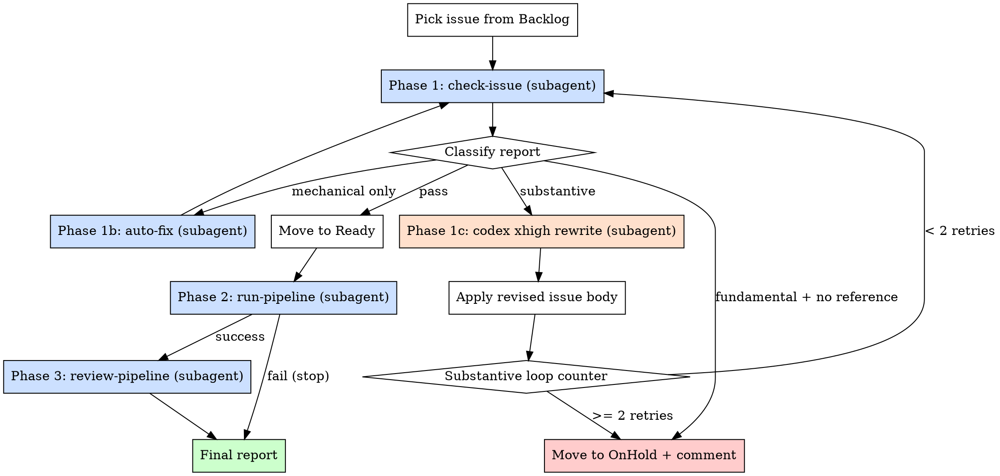

# Auto Pipeline

Take **one** Backlog issue all the way from quality gate to **Final review** without human intervention. The merge step itself is still left to the human (see `/final-review`).

This skill is an **orchestrator**: it never runs the heavy work itself. Each phase is delegated to a fresh-context subagent that invokes the relevant existing skill (`check-issue`, `fix-issue`, `run-pipeline`, `review-pipeline`). The only thing the main agent does directly is:

1. pick the issue,
2. read structured reports from subagents,
3. decide whether to retry, hand off to `codex` (xhigh) for substantive rewrites, or park the issue on OnHold,
4. move the project board card forward.

## Invocation

- `/auto-pipeline` — pick the highest-priority Backlog issue (Good label first, then lowest issue number)
- `/auto-pipeline 123` — run on a specific Backlog issue number

## Constants

GitHub Project board IDs:

| Constant | Value |
|----------|-------|
| `PROJECT_ID` | `PVT_kwDOBrtarc4BRNVy` |
| `STATUS_FIELD_ID` | `PVTSSF_lADOBrtarc4BRNVyzg_GmQc` |
| `STATUS_BACKLOG` | `ab337660` |
| `STATUS_ON_HOLD` | `48dfe446` |
| `STATUS_READY` | `f37d0d80` |
| `STATUS_IN_PROGRESS` | `a12cfc9c` |
| `STATUS_REVIEW_POOL` | `7082ed60` |
| `STATUS_FINAL_REVIEW` | `51a3d8bb` |

## Autonomous Mode

Runs **fully autonomously** — no confirmation prompts, no clarifying questions. All sub-skills called from here must also auto-approve. The human only gets involved at `/final-review`, or when the issue is parked on OnHold with a diagnostic comment.

## Architecture



## Step 0: Pick the Issue

`scripts/pipeline_board.py backlog` only accepts `model` or `rule` (NOT `all`), and it returns `{"issue_type": ..., "items": [{number, title, item_id, labels, has_good}, ...]}`. So the picker has to query both kinds, merge, and sort `Good` first then by issue number.

**Gotcha:** `pipeline_board.py backlog <kind>` exits with code **1** when the kind has zero items, even though it still prints valid JSON. Do NOT pass `check=True` to `subprocess.run`; parse stdout unconditionally and ignore the return code.

### 0a. Pick by number (if supplied)

```bash
ISSUE=<number>

PICK_JSON=$(ISSUE="$ISSUE" python3 <<'PY'
import json, os, subprocess
target = int(os.environ["ISSUE"])
hit = None
for kind in ("model", "rule"):
    out = subprocess.run(
        ["uv", "run", "--project", "scripts", "scripts/pipeline_board.py",
         "backlog", kind, "--format", "json"],
        capture_output=True, text=True
    )
    try:
        items = json.loads(out.stdout)["items"]
    except Exception:
        items = []
    for it in items:
        if it["number"] == target:
            hit = it
            break
    if hit: break
print(json.dumps(hit) if hit else "")
PY
)

if [ -z "$PICK_JSON" ]; then
  echo "Issue #$ISSUE is not in the Backlog column."
  exit 0
fi
```

### 0b. Pick top of Backlog (if no number supplied)

```bash
PICK_JSON=$(python3 <<'PY'
import json, subprocess
items = []
for kind in ("model", "rule"):
    out = subprocess.run(
        ["uv", "run", "--project", "scripts", "scripts/pipeline_board.py",
         "backlog", kind, "--format", "json"],
        capture_output=True, text=True
    )
    try:
        items.extend(json.loads(out.stdout)["items"])
    except Exception:
        pass
if not items:
    print("")
else:
    # Good label first, then lowest issue number
    items.sort(key=lambda i: (not i["has_good"], i["number"]))
    print(json.dumps(items[0]))
PY
)

if [ -z "$PICK_JSON" ]; then
  echo "Backlog is empty."
  exit 0
fi
```

### 0c. Extract fields

```bash
ISSUE=$(printf '%s' "$PICK_JSON" | python3 -c "import sys,json; print(json.load(sys.stdin)['number'])")
ITEM_ID=$(printf '%s' "$PICK_JSON" | python3 -c "import sys,json; print(json.load(sys.stdin)['item_id'])")
TITLE=$(printf '%s' "$PICK_JSON"  | python3 -c "import sys,json; print(json.load(sys.stdin)['title'])")
LABELS=$(printf '%s' "$PICK_JSON" | python3 -c "import sys,json; print(','.join(json.load(sys.stdin)['labels']))")

echo "Auto-pipeline starting on issue #$ISSUE — $TITLE"
echo "  item_id: $ITEM_ID"
echo "  labels:  $LABELS"
```

### 0d. Initialise loop counter

```bash
SUBSTANTIVE_RETRIES=0
MAX_SUBSTANTIVE_RETRIES=2
```

## Step 1: Quality Gate (check-issue + fix loop)

### 1a. Dispatch `check-issue` subagent

Use the `Agent` tool with `subagent_type=general-purpose`. The subagent must run the existing `check-issue` skill (force re-check) and report back **structured JSON only**.

**Prompt template:**

```
Run the repo-local /check-issue skill on GitHub issue #<ISSUE> in the
problem-reductions repository. Read .claude/skills/check-issue/SKILL.md
and follow it exactly, including the `--force` re-check behaviour.

For `[Rule]` issues, the Completeness check (Rule Check 5) is MANDATORY
and is the most important check — do not skip it or stub it. You must:
  - find and read the cited paper or textbook section,
  - quote the precise statement (theorem/precondition) you are relying on,
  - enumerate the corner cases the source model allows by inspecting
    `pred show <Source> --json` and the existing src/rules/*.rs files
    that already reduce from the same source,
  - trace the issue's algorithm by hand on at least 2 non-canonical
    corner cases, and
  - report the literature evidence and the traced corner cases in the
    GitHub comment.

If the cited construction is only valid under a precondition the issue
does not state, that is a substantive failure. If the cited reference
does not actually contain the reduction at all, that is a fundamental
failure with severity "fundamental".

After it completes, return ONLY a single fenced ```json``` block with this shape:

{
  "verdict": "pass" | "fail",
  "errors": [{"check": "...", "label": "...", "summary": "...", "severity": "mechanical" | "substantive" | "fundamental"}],
  "warnings": [{"check": "...", "summary": "...", "severity": "mechanical" | "substantive"}],
  "fundamental_no_reference": false,
  "comment_url": "<URL of the check-issue comment that was posted>"
}

Severity rules:
- "mechanical": missing/wrong fields the issue body itself can fix without
  changing the underlying claim (typos, missing G&J reference, wrong
  problem alias, malformed example, wrong section heading).
- "substantive": the claim itself is wrong or unsupported (incorrect
  complexity, broken overhead formula, mis-cited paper, reduction proof
  sketch is flawed) but a public reference probably exists.
- "fundamental": the proposed algorithm/reduction is mathematically
  unsound AND your literature search found no public reference that
  would salvage it. Only use this label if you genuinely searched.

Set "fundamental_no_reference": true if and only if at least one finding
is severity "fundamental".

Do NOT modify any files. Do NOT post additional comments beyond what
/check-issue itself posts. Do NOT brainstorm with a user.
```

### 1b. Classify the report

Parse the JSON. Then branch:

| Condition | Action |
|---|---|
| `verdict == "pass"` | → Step 1d (move to Ready) |
| `fundamental_no_reference == true` | → Step 1e (OnHold) |
| all `errors`/`warnings` have `severity == "mechanical"` | → Step 1c-mech |
| any `severity == "substantive"` | → Step 1c-sub |

### 1c-mech. Dispatch auto-fix subagent (mechanical only)

```
Run the repo-local /fix-issue skill on GitHub issue #<ISSUE>, but in
auto-fix-only mode:

- Only apply the mechanical auto-fixes described in fix-issue Step 3.
- Do NOT ask the human anything.
- Do NOT brainstorm substantive issues — if any remain, leave them
  unchanged and report them.
- After auto-fixing, edit the issue body via `gh issue edit` as usual,
  but DO NOT move the project card and DO NOT re-run /check-issue.

Return ONLY a fenced ```json``` block:

{
  "applied": ["<short description of each auto-fix>"],
  "skipped_substantive": ["<short description>"],
  "errors": ["<any error message>"]
}
```

When the subagent returns, loop back to **Step 1a** (re-check). Do not increment `SUBSTANTIVE_RETRIES` — mechanical fixes are deterministic and cheap.

### 1c-sub. Codex xhigh rewrite (substantive)

If `SUBSTANTIVE_RETRIES >= MAX_SUBSTANTIVE_RETRIES` → jump to Step 1e (OnHold) with reason `"substantive issues persist after $MAX_SUBSTANTIVE_RETRIES codex rewrites"`.

Otherwise, fetch the current issue body and the latest check-issue comment:

```bash
ISSUE_BODY=$(gh issue view "$ISSUE" --json body --jq .body)
CHECK_REPORT=$(gh issue view "$ISSUE" --json comments --jq '[.comments[] | select(.body | startswith("## Issue Quality Check"))] | last | .body')
```

Dispatch the `codex:codex-rescue` subagent to produce a revised issue body. Brief it the way the rescue subagent expects: state goal, summarise what was tried, and ask for a concrete artefact.

**Prompt template:**

```
The GitHub issue #<ISSUE> in the problem-reductions repo failed
/check-issue with substantive issues. We need you to produce a revised
issue body that fixes those substantive problems, grounded in public
literature.

Run `codex` non-interactively at maximum reasoning effort:

  codex exec -c model="gpt-5.4" -c model_reasoning_effort="high" --skip-git-repo-check "<PROMPT_FILE>"

where PROMPT_FILE contains:

  You are editing a GitHub issue that proposes a reduction rule or
  problem model. The issue failed an automated quality check. Your job:

  1. Read the original issue body (below, delimited by <<<BODY>>>).
  2. Read the check-issue report (below, delimited by <<<REPORT>>>).
  3. For each substantive finding, decide whether a fix grounded in
     public literature is possible. If yes, apply it (rewriting the
     relevant section and citing the source by name + year + venue).
  4. If, after honest investigation, the underlying algorithm or
     reduction is mathematically unsound and NO public reference would
     salvage it, do not paper over it. Instead, return exactly:

       FUNDAMENTAL_FLAW: <one-line reason>

     on the first line, with no markdown fences.

  Otherwise, return the full revised issue body, in the same section
  structure as the original, inside a fenced ```markdown``` block.

  <<<BODY>>>
  <original issue body verbatim>
  <<<REPORT>>>
  <latest check-issue comment verbatim>

After codex completes, report back ONLY one of these two JSON shapes:

  {"outcome": "revised", "new_body": "<full revised markdown>"}

or

  {"outcome": "fundamental_flaw", "reason": "<one-line reason>"}

Do not edit any files yourself.
```

When the subagent returns:

- **`outcome == "fundamental_flaw"`** → Step 1e (OnHold) with the reason.
- **`outcome == "revised"`** → apply the new body in the main agent (DO NOT let the subagent edit GitHub — keep edits in the orchestrator so we always know what was written):

  ```bash
  printf '%s' "$NEW_BODY" > /tmp/auto-pipeline-issue-$ISSUE.md
  gh issue edit "$ISSUE" --body-file /tmp/auto-pipeline-issue-$ISSUE.md
  gh issue comment "$ISSUE" --body "auto-pipeline: issue body rewritten by codex xhigh (substantive retry $((SUBSTANTIVE_RETRIES + 1)))"
  rm /tmp/auto-pipeline-issue-$ISSUE.md
  ```

  Increment: `SUBSTANTIVE_RETRIES=$((SUBSTANTIVE_RETRIES + 1))` and loop back to **Step 1a**.

### 1d. Move card to Ready

```bash
uv run --project scripts scripts/pipeline_board.py move "$ITEM_ID" ready
gh issue comment "$ISSUE" --body "auto-pipeline: quality check passed — moving to Ready."
```

Continue to Step 2.

### 1e. Park on OnHold

```bash
REASON="<one-line reason>"
gh issue comment "$ISSUE" --body "auto-pipeline: parked on OnHold — $REASON. Human triage needed."
uv run --project scripts scripts/pipeline_board.py move "$ITEM_ID" on-hold
```

Print the final report and STOP:

```
Auto-pipeline halted at quality gate:
  Issue:  #<ISSUE>
  Reason: <REASON>
  Board:  Backlog -> OnHold
```

## Step 2: Implementation (`run-pipeline` subagent)

Dispatch the existing `run-pipeline` skill against the same issue:

**Prompt template:**

```
Run the repo-local /run-pipeline skill on the specific issue #<ISSUE>
(already in the Ready column). Read .claude/skills/run-pipeline/SKILL.md
and follow it exactly. The skill itself handles the worktree, the
issue-to-pr invocation, and the board moves to In Progress and Review
pool.

After it completes, return ONLY a fenced ```json``` block:

{
  "outcome": "success" | "failure",
  "pr_number": <int or null>,
  "board_status": "Review pool" | "OnHold" | "<other>",
  "summary": "<one-line description of what happened>"
}
```

When the subagent returns:

- **`outcome == "success"`** → continue to Step 3.
- **`outcome == "failure"`** → STOP. The `run-pipeline` skill already moves the card to OnHold and posts a diagnostic comment, so we do not duplicate. Print:

  ```
  Auto-pipeline halted at implementation:
    Issue:  #<ISSUE>
    PR:     #<PR or none>
    Reason: <summary>
    Board:  <board_status>
  ```

  Do NOT call codex to rescue here — implementation failures are CI/code-shape problems that need human eyes.

## Step 3: Agentic Review (`review-pipeline` subagent)

Dispatch the existing `review-pipeline` skill against the PR:

**Prompt template:**

```
Run the repo-local /review-pipeline skill on PR #<PR>. Read
.claude/skills/review-pipeline/SKILL.md and follow it exactly. It must
always move the PR to "Final review" at the end (that is the skill's
contract).

For any PR that adds a reduction rule, the round-trip execution check
(review-structural Step 4b) is MANDATORY:
  - locate the closed-loop test(s),
  - actually invoke `cargo test --lib -- --exact <test_name>` and paste
    the "test result: ok. N passed" line into the review,
  - verify the test exercises the full round-trip — concrete non-trivial
    source instance, reduce to target, solve target, extract solution
    back, assert extracted source configuration is optimal (compare
    against BruteForce on the source). Tests that only check
    `extract_solution(...).is_some()`, only assert on target-side values,
    or use an instance with a unique optimum, do NOT satisfy this.
A weak or missing round-trip is a Critical quality issue, not Minor.

After it completes, return ONLY a fenced ```json``` block:

{
  "outcome": "success" | "failure",
  "board_status": "Final review" | "<other>",
  "review_verdicts": {"structural": "...", "quality": "...", "agentic": "..."},
  "summary": "<one-line description>"
}
```

Whatever the outcome, the PR is now either in Final review (success) or stuck somewhere the review skill left it (failure). Print the final report:

```
Auto-pipeline complete:
  Issue:  #<ISSUE>
  PR:     #<PR>
  Board:  <board_status>
  Verdicts: structural=<...> quality=<...> agentic=<...>
  Next:   human runs /final-review
```

## Reporting Contract

Every subagent dispatched by this skill MUST return a single fenced ```json``` block as the last thing in its message. The main agent parses only that block. If a subagent returns malformed JSON:

1. Re-dispatch once with the prompt prefixed by `Your previous reply did not contain a parseable ```json``` block as required. Run the skill again from scratch and return ONLY the JSON block.`
2. If the second attempt also fails, park the issue on OnHold with reason `subagent contract violation in <phase>`.

## Common Mistakes

| Mistake | Fix |
|---------|-----|
| Calling sub-skills directly in the main agent | Always dispatch via `Agent` tool — keeps the orchestrator context clean |
| Looping codex more than 2 times on substantive issues | Hard cap at 2 retries; park on OnHold afterwards |
| Letting the codex subagent edit GitHub | The orchestrator owns all `gh issue edit` calls — codex only returns text |
| Treating implementation failures as substantive issue problems | Step 2 failures go straight to a stop; they are not eligible for codex rescue |
| Skipping the re-check after auto-fix | Always re-run check-issue after either mechanical or substantive fixes |
| Forgetting to increment `SUBSTANTIVE_RETRIES` | Only substantive rewrites count toward the cap; mechanical fixes do not |
| Picking from a non-Backlog column when no issue number is given | Auto-pick must read from Backlog only — never from OnHold, Ready, or elsewhere |
