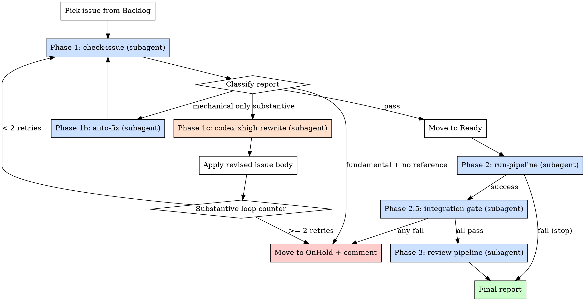

# Auto Pipeline

Take **one** Backlog issue all the way from quality gate to **Final review** without human intervention. The merge step itself is still left to the human (see `/final-review`).

This skill is an **orchestrator**: it never runs the heavy work itself. Each phase is delegated to a fresh-context subagent. Most phases invoke an existing skill (`check-issue`, `fix-issue`, `run-pipeline`, `review-pipeline`); Phase 2.5 is owned by the orchestrator and runs raw `cargo test --workspace` + `make paper` to catch breakage the per-item sub-skills cannot see. The only thing the main agent does directly is:

1. pick the issue,
2. read structured reports from subagents,
3. decide whether to retry, hand off to `codex` (xhigh) for substantive rewrites, or park the issue on OnHold,
4. move the project board card forward.

## Invocation

- `/auto-pipeline` — pick the highest-priority Backlog issue (Good label first, then lowest issue number)
- `/auto-pipeline 123` — run on a specific Backlog issue number

## Board states this skill writes

Only three transitions happen here directly (the rest are owned by sub-skills):

| Symbolic name passed to `pipeline_board.py move` | When |
|---|---|
| `ready` | Step 1d (quality gate passed) |
| `on-hold` | Step 1e (fundamental flaw or substantive retry cap hit) |

The orchestrator reads the Backlog column in Step 0 and never writes to it. ID constants for all other columns live in [`run-pipeline`](../run-pipeline/SKILL.md) / [`review-pipeline`](../review-pipeline/SKILL.md) — sub-skills move the card through In Progress → Review pool → Final review.

## Autonomous Mode

Runs **fully autonomously** — no confirmation prompts, no clarifying questions. All sub-skills called from here must also auto-approve. The human only gets involved at `/final-review`, or when the issue is parked on OnHold with a diagnostic comment.

## Subagent Contract

Every subagent dispatched by this skill operates under the same contract. Each per-step prompt below references this contract by name and only adds the step-specific scope + JSON shape.

**Output:** the subagent's LAST message must be a single fenced ```json``` block matching the shape given by the dispatching step. No prose before or after. The orchestrator parses only that block.

**Don'ts:**
- Do NOT modify any source files unless the step's prompt explicitly says so.
- Do NOT move the project board card. The orchestrator owns all board transitions.
- Do NOT open pull requests or invoke `/issue-to-pr`, `gh pr create`, etc. unless the step is `run-pipeline` (which manages its own PR via the existing skill).
- Do NOT brainstorm with a human or wait for input.

**Severity vocabulary** (used by every Phase-1 step that reports findings):
- `mechanical` — issue-body-fixable without changing the claim (typo, missing G&J number, wrong alias, malformed example, wrong heading).
- `substantive` — the claim is wrong or unsupported (incorrect complexity, broken overhead, mis-cited paper, flawed proof sketch) but a public reference probably exists.
- `fundamental` — algorithm/reduction is mathematically unsound AND your literature search found no public reference that would salvage it. Only assign after a genuine search.

**Malformed JSON:** if the subagent's reply is missing the fenced JSON block, re-dispatch once with the prompt prefixed by "Your previous reply did not contain a parseable JSON block. Run the skill again from scratch and return ONLY the JSON block." If the second attempt also fails, park the issue on OnHold with reason `subagent contract violation in <phase>`.

## Architecture



## Step 0: Pick the Issue

`scripts/pipeline_board.py backlog` accepts only `model` or `rule` (NOT `all`), returns `{"issue_type": ..., "items": [{number, title, item_id, labels, has_good}, ...]}`, and **exits with code 1 when the queried kind is empty** even though it prints valid JSON — so the picker queries both kinds and ignores subprocess return codes.

### 0a. Pick

Set `ISSUE` to the requested number, or leave empty to auto-pick the top of Backlog (Good label first, then lowest number):

```bash
ISSUE="${ISSUE:-}"  # set this to a specific number, or leave empty to auto-pick

PICK_JSON=$(ISSUE="$ISSUE" python3 <<'PY'
import json, os, subprocess
target = int(os.environ["ISSUE"]) if os.environ.get("ISSUE") else None
items = []
for kind in ("model", "rule"):
    out = subprocess.run(
        ["uv", "run", "--project", "scripts", "scripts/pipeline_board.py",
         "backlog", kind, "--format", "json"],
        capture_output=True, text=True,
    )
    try:
        items.extend(json.loads(out.stdout)["items"])
    except Exception:
        pass
if target is not None:
    hit = next((i for i in items if i["number"] == target), None)
    print(json.dumps(hit) if hit else "")
elif items:
    items.sort(key=lambda i: (not i["has_good"], i["number"]))
    print(json.dumps(items[0]))
else:
    print("")
PY
)

if [ -z "$PICK_JSON" ]; then
  if [ -n "$ISSUE" ]; then
    echo "Issue #$ISSUE is not in the Backlog column."
  else
    echo "Backlog is empty."
  fi
  exit 0
fi
```

### 0b. Extract fields

```bash
ISSUE=$(printf '%s' "$PICK_JSON" | python3 -c "import sys,json; print(json.load(sys.stdin)['number'])")
ITEM_ID=$(printf '%s' "$PICK_JSON" | python3 -c "import sys,json; print(json.load(sys.stdin)['item_id'])")
TITLE=$(printf '%s' "$PICK_JSON"  | python3 -c "import sys,json; print(json.load(sys.stdin)['title'])")
LABELS=$(printf '%s' "$PICK_JSON" | python3 -c "import sys,json; print(','.join(json.load(sys.stdin)['labels']))")

echo "Auto-pipeline starting on issue #$ISSUE — $TITLE"
echo "  item_id: $ITEM_ID"
echo "  labels:  $LABELS"
```

### 0c. Initialise loop counter

```bash
SUBSTANTIVE_RETRIES=0
MAX_SUBSTANTIVE_RETRIES=2
```

## Step 1: Quality Gate (check-issue + fix loop)

### 1a. Dispatch `check-issue` subagent

Use the `Agent` tool with `subagent_type=general-purpose`. The subagent must run the existing `check-issue` skill (force re-check) and report back **structured JSON only**.

**Prompt template** (subagent follows the Subagent Contract above for everything else):

```
Run /check-issue on issue #<ISSUE> in CodingThrust/problem-reductions
(--force re-check). Follow .claude/skills/check-issue/SKILL.md exactly.

For [Rule] issues, Rule Check 5 (Completeness) is the most important
check — find and quote the cited theorem, enumerate corner cases the
source model allows via `pred show <Source> --json` and existing
src/rules/ implementations, and hand-trace the algorithm on >= 2
non-canonical corner cases. A cited precondition the issue ignores is
"substantive"; a cited reference that does not contain the reduction
at all is "fundamental" (set fundamental_no_reference: true).

You may post the check-issue comment and apply failure/Good labels per
the skill. Do NOT close the issue.

Return ONLY this JSON shape:
{
  "verdict": "pass" | "fail",
  "errors": [{"check": "...", "label": "...", "summary": "...", "severity": "mechanical|substantive|fundamental"}],
  "warnings": [{"check": "...", "summary": "...", "severity": "mechanical|substantive"}],
  "fundamental_no_reference": true | false,
  "comment_url": "<URL of the posted check-issue comment>"
}
```

### 1b. Classify the report

Parse the JSON. Then branch:

| Condition | Action |
|---|---|
| `verdict == "pass"` | → Step 1d (move to Ready) |
| `fundamental_no_reference == true` | → Step 1e (OnHold) |
| all `errors`/`warnings` have `severity == "mechanical"` | → Step 1c-mech |
| any `severity == "substantive"` | → Step 1c-sub |

### 1c-mech. Dispatch auto-fix subagent (mechanical only)

```
Run /fix-issue on issue #<ISSUE> in auto-fix-only mode:
- Apply only the mechanical auto-fixes from fix-issue's auto-fix step
  (the one that runs before the human-brainstorm step).
- Edit the issue body via `gh issue edit` as the skill instructs.
- Skip the re-check and the project-card move (orchestrator handles
  re-check by re-dispatching Phase 1).

Return ONLY this JSON shape:
{
  "applied": ["<short description of each auto-fix>"],
  "skipped_substantive": ["<short description>"],
  "errors": ["<any error message>"]
}
```

Loop back to **Step 1a** (re-check). Do not increment `SUBSTANTIVE_RETRIES` — mechanical fixes don't count toward the cap.

### 1c-sub. Codex xhigh rewrite (substantive)

If `SUBSTANTIVE_RETRIES >= MAX_SUBSTANTIVE_RETRIES` → jump to Step 1e (OnHold) with reason `"substantive issues persist after $MAX_SUBSTANTIVE_RETRIES codex rewrites"`.

Otherwise, fetch the current issue body and the latest check-issue comment:

```bash
ISSUE_BODY=$(gh issue view "$ISSUE" --json body --jq .body)
CHECK_REPORT=$(gh issue view "$ISSUE" --json comments --jq '[.comments[] | select(.body | startswith("## Issue Quality Check"))] | last | .body')
```

Dispatch the `codex:codex-rescue` subagent to produce a revised issue body. Brief it the way the rescue subagent expects: state goal, summarise what was tried, and ask for a concrete artefact.

**Prompt template:**

```
Issue #<ISSUE> failed /check-issue with substantive findings. Run
codex non-interactively at maximum reasoning effort to produce a
revised issue body grounded in public literature:

  codex exec -c model="gpt-5.4" -c model_reasoning_effort="high" --skip-git-repo-check "$(cat <PROMPT_FILE>)"

where <PROMPT_FILE> contains, in order:

  You are revising a GitHub issue that proposes a reduction rule or
  problem model. For each substantive finding in the check report,
  apply a fix grounded in public literature (cite source by name +
  year + venue). If honest investigation shows the algorithm is
  mathematically unsound AND no public reference would salvage it,
  return on the first line (no fences):

    FUNDAMENTAL_FLAW: <one-line reason>

  Otherwise return the full revised issue body inside a fenced
  ```markdown``` block, preserving the original section structure.

  <<<BODY>>>
  [original issue body verbatim]
  <<<REPORT>>>
  [latest check-issue comment verbatim]

Return ONLY one of these JSON shapes:
  {"outcome": "revised", "new_body": "<full revised markdown>"}
  {"outcome": "fundamental_flaw", "reason": "<one-line reason>"}
```

When the subagent returns:

- **`outcome == "fundamental_flaw"`** → Step 1e (OnHold) with the reason.
- **`outcome == "revised"`** → apply the new body in the main agent (DO NOT let the subagent edit GitHub — keep edits in the orchestrator so we always know what was written):

  ```bash
  printf '%s' "$NEW_BODY" > /tmp/auto-pipeline-issue-$ISSUE.md
  gh issue edit "$ISSUE" --body-file /tmp/auto-pipeline-issue-$ISSUE.md
  gh issue comment "$ISSUE" --body "auto-pipeline: issue body rewritten by codex xhigh (substantive retry $((SUBSTANTIVE_RETRIES + 1)))"
  rm /tmp/auto-pipeline-issue-$ISSUE.md
  ```

  Increment: `SUBSTANTIVE_RETRIES=$((SUBSTANTIVE_RETRIES + 1))` and loop back to **Step 1a**.

### 1d. Move card to Ready

```bash
uv run --project scripts scripts/pipeline_board.py move "$ITEM_ID" ready
gh issue comment "$ISSUE" --body "auto-pipeline: quality check passed — moving to Ready."
```

Continue to Step 2.

### 1e. Park on OnHold

```bash
REASON="<one-line reason>"
gh issue comment "$ISSUE" --body "auto-pipeline: parked on OnHold — $REASON. Human triage needed."
uv run --project scripts scripts/pipeline_board.py move "$ITEM_ID" on-hold
```

Print the final report and STOP:

```
Auto-pipeline halted at quality gate:
  Issue:  #<ISSUE>
  Reason: <REASON>
  Board:  Backlog -> OnHold
```

## Step 2: Implementation (`run-pipeline` subagent)

Dispatch the existing `run-pipeline` skill against the same issue:

**Prompt template** (this is the one step the Subagent Contract's no-board-moves rule does NOT apply to — run-pipeline owns its worktree, PR, and board transitions from Ready to Review pool):

```
Run /run-pipeline on issue #<ISSUE> (already in Ready). Follow
.claude/skills/run-pipeline/SKILL.md exactly — it handles the
worktree, issue-to-pr invocation, and the Ready -> In Progress ->
Review pool transitions, including moving to OnHold on failure.

Return ONLY this JSON shape:
{
  "outcome": "success" | "failure",
  "pr_number": <int or null>,
  "board_status": "Review pool" | "OnHold" | "<other>",
  "summary": "<one-line description of what happened>"
}
```

When the subagent returns:

- **`outcome == "success"`** → continue to Step 2.5.
- **`outcome == "failure"`** → STOP. The `run-pipeline` skill already moves the card to OnHold and posts a diagnostic comment, so we do not duplicate. Print:

  ```
  Auto-pipeline halted at implementation:
    Issue:  #<ISSUE>
    PR:     #<PR or none>
    Reason: <summary>
    Board:  <board_status>
  ```

  Do NOT call codex to rescue here — implementation failures are CI/code-shape problems that need human eyes.

## Step 2.5: Integration Gate (orchestrator-owned)

The per-item sub-skills only test the new item in isolation, so cross-crate regressions (e.g. a relaxed model validator breaking pre-existing CLI tests) and paper-compile errors (orphan bib keys, math-mode typos like `intersect` vs Typst's `inter`) slip through Phase 2 and Phase 3. CI catches both, but in batch mode (many issues on one branch) breakage accumulates silently. Running this gate after every Phase 2 success closes the loop.

Dispatch a fresh subagent (`subagent_type=general-purpose`, not invoking any existing skill):

```
Run the auto-pipeline integration gate on PR #<PR>. Check out the PR
branch in a fresh worktree, run `make check` then `make paper`, clean up.
Do not modify files. Return ONLY:

{"tests": "pass" | "fail", "paper": "pass" | "fail",
 "first_failure": "<first failing test or typst error, or empty>"}
```

- Both `pass` → continue to Step 3.
- Either `fail` → hand the `first_failure` to `codex:codex-rescue` for a fix-it pass (CI-class problems are usually small: deleting a stale test, fixing a typo'd bib key, swapping `intersect` for `inter`). After codex returns, re-run Step 2.5 once. If still failing, park on OnHold.

## Step 3: Agentic Review (`review-pipeline` subagent)

Dispatch the existing `review-pipeline` skill against the PR:

**Prompt template** (board transitions to Final review are owned by review-pipeline; that's its contract):

```
Run /review-pipeline on PR #<PR>. Follow
.claude/skills/review-pipeline/SKILL.md exactly; it always moves the
PR to Final review at the end.

For PRs adding a reduction rule, review-structural Step 4b (round-trip
execution) is mandatory — see that skill for the four criteria.

Return ONLY this JSON shape:
{
  "outcome": "success" | "failure",
  "board_status": "Final review" | "<other>",
  "review_verdicts": {"structural": "...", "quality": "...", "agentic": "..."},
  "summary": "<one-line description>"
}
```

Whatever the outcome, the PR is now either in Final review (success) or stuck somewhere the review skill left it (failure). Print the final report:

```
Auto-pipeline complete:
  Issue:  #<ISSUE>
  PR:     #<PR>
  Board:  <board_status>
  Verdicts: structural=<...> quality=<...> agentic=<...>
  Next:   human runs /final-review
```

## Common Mistakes

| Mistake | Fix |
|---------|-----|
| Calling sub-skills directly in the main agent | Always dispatch via `Agent` tool — keeps the orchestrator context clean |
| Letting the codex subagent edit GitHub | The orchestrator owns all `gh issue edit` calls — codex only returns text |
| Treating implementation failures as substantive issue problems | Step 2 failures go straight to a stop; they are not eligible for codex rescue |
| Picking from a non-Backlog column when no issue number is given | Auto-pick must read from Backlog only — never from OnHold, Ready, or elsewhere |
| Skipping Step 2.5 because Phase 2 reported `success` | Phase 2 success is scoped to the new item's own tests; workspace-wide regressions and paper-compile bugs are only visible from `make check` + `make paper`. |
