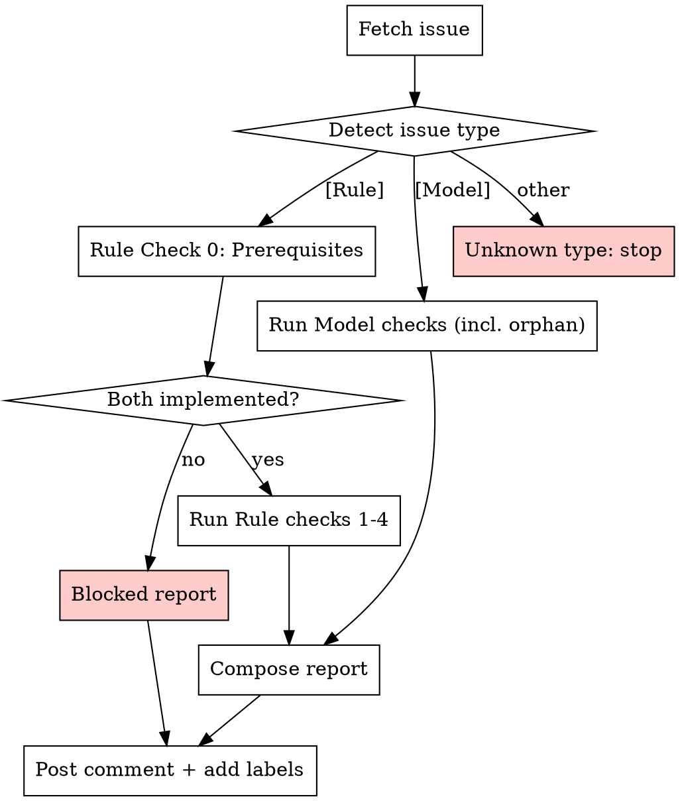

# Check Issue

Quality gate for `[Rule]` and `[Model]` GitHub issues. Runs 4 checks (adapted per issue type) and posts a structured report as a GitHub comment. Adds labels for failures but does NOT close issues.

## Invocation

```
/check-issue <issue-number>
```

## Process



### Step 0: Fetch and Parse Issue

```bash
gh issue view <NUMBER> --json title,body,labels
```

- Detect issue type from title: `[Rule]` or `[Model]`
- If neither, stop with message: "This skill only checks [Rule] and [Model] issues."

---

# Part A: Rule Issue Checks

Applies when the title contains `[Rule]`.

## Rule Check 0: Prerequisites (fail label: `Blocked`)

**Goal:** Are both source and target problems implemented in the codebase?

A reduction rule cannot be implemented if the source or target problem does not exist in code. This is a **hard prerequisite** — if either is missing, skip all remaining checks.

1. Parse **Source** and **Target** problem names from the issue body.

2. Resolve problem aliases and verify implementation:
   ```bash
   pred show <source> --json 2>/dev/null
   pred show <target> --json 2>/dev/null
   ```
   Try aliases first (e.g., "MIS" → "MaximumIndependentSet"), then the full name.

3. Decision:
   - **Both succeed** → **Pass**. Store the JSON output for use in subsequent checks (Check 1 overhead comparison, Check 3e cross-validation, Check 4c metric names).
   - **Either fails** → **Fail** with label `Blocked`
     - Message: "Cannot evaluate: `<problem>` is not implemented in the codebase. The corresponding [Model] issue must be merged first."
     - **Skip all remaining checks** (Check 1–4). The report should only contain Check 0.

---

## Rule Check 1: Usefulness (fail label: `Useless`)

**Goal:** Is this reduction novel or does it improve on an existing one?

1. Check existing path (using resolved names from Check 0):
   ```bash
   pred path <source> <target> --json
   ```

2. Decision (principle: new rule must reduce the reduction overhead):
   - **No path exists** → **Pass** (novel reduction)
   - **Path exists** → compare overhead:
     - Parse the proposed overhead from the issue's "Size Overhead" table
     - Parse the overhead of the path.
     - If proposed overhead is **strictly lower** on at least one dimension (and not higher on any) → **Pass** ("improves existing reduction")
     - If overhead is **equal or higher** on all dimensions → **Fail**
     - If overhead comparison is ambiguous (different dimensions, incomparable expressions) → **Warn** with explanation

3. Check **Motivation** field: if empty, placeholder, or just "enables X" without explaining *why this path matters* → **Warn**

---

## Rule Check 2: Non-trivial (fail label: `Trivial`)

**Goal:** Does the reduction involve genuine structural transformation?

Read the "Reduction Algorithm" section and flag as **Fail** if:

- **Variable substitution only:** The mapping is a 1-to-1 relabeling (e.g., `x_i → 1 - x_i` for complement problems). A valid reduction must construct new constraints, objectives, or graph structure.
- **Subtype coercion:** The reduction merely casts to a more general type within an existing variant hierarchy (e.g., UnitDiskGraph → SimpleGraph) with no structural change to the problem instance.
- **Same-problem identity:** Reducing between variants of the same problem with no insight (e.g., `MIS<SimpleGraph, One>` → `MIS<SimpleGraph, i32>` by setting all weights to 1).
- **Insufficient detail:** The algorithm is a hand-wave ("map variables accordingly", "follows from the definition") — not a step-by-step procedure a programmer could implement. This is also a **Fail**.

If the construction involves gadgets, penalty terms, auxiliary variables, or non-trivial structural transformation → **Pass**.

Note: if a trivial reduction make original disconnected problems connected, it is also **Pass**.

---

## Rule Check 3: Correctness (fail label: `Wrong`)

**Goal:** Are the cited references real and do they support the claims?

### 3a: Extract References

Parse all literature citations from the issue body — paper titles, author names, years, DOIs, arxiv IDs, textbook references.

### 3b: Cross-check Against Project Knowledge Base

First, read `references.md` (in this skill's directory) for quick fact-checking — it contains known complexity bounds, key results, and established reductions with BibTeX keys. If the issue's claims contradict known facts in this file → **Fail** immediately.

Then read `docs/paper/references.bib` for the full bibliography. If a cited paper is already in the bibliography:
- Verify the claim in the issue matches what the paper actually says
- If the issue cites a result from a known paper but misquotes it → **Fail**

### 3c: External Verification (best-effort fallback chain)

For each reference NOT in the bibliography:

1. **Try arxiv MCP** (if available): search by title/author/arxiv ID
2. **Try Semantic Scholar MCP** (if available): search by title/DOI
3. **Fall back to WebSearch + WebFetch**: search for the paper, fetch abstract

For each reference, verify:
- Paper exists with matching title, authors, and year
- The specific theorem/result cited actually appears in the paper
- Cross-check the claim against at least one other source (survey paper, textbook, or independent reference)

If any cited fact **cannot be verified** (paper not found, claim not in paper) → **Fail** with specifics.

### 3d: Better Algorithm Discovery (not fatal)

While searching, if you find:
- A **more recent paper** that supersedes the cited reference
- A **lower overhead** construction for the same reduction
- A **different approach** that achieves better bounds

→ Include in the report as a **Recommendation** (not a failure). Example: "Note: Smith et al. (2024) improve on this with O(n) overhead instead of O(n^2)."

### 3e: Cross-validate Against Code Implementation

Using the `pred show` JSON stored from Check 0, verify the issue's description is consistent with the actual code:

1. **Source problem consistency:**
   - Compare the issue's description of the source problem (input structure, objective, constraints) against the code's actual implementation (fields, `direction()`, `evaluate()` semantics)
   - If the issue says "MIS maximizes vertex count" but the code uses weighted sums → **Fail**

2. **Target problem consistency:**
   - Same check for the target problem
   - Verify the target's field names and semantics match what the issue's reduction algorithm constructs

3. **Reduction algorithm references valid fields/methods:**
   - Every field name referenced in the algorithm (e.g., "add edge to E'", "set weight w_i") must correspond to actual fields/methods on the source or target type
   - Check against `size_fields` and schema from `pred show --json`

4. **Size overhead metric names match target:**
   - Every metric in the "Size Overhead" table must be a valid getter on the target problem
   - This overlaps with Check 4c but is a **correctness** concern (wrong metric names = wrong reduction), not just a writing concern

If any mismatch found → **Fail** with specifics about what the issue claims vs. what the code actually implements.

---

## Rule Check 4: Well-written (fail label: `PoorWritten`)

**Goal:** Is the issue clear, complete, and implementable?

### 4a: Information Completeness

Check all template sections are present and substantive (not placeholder text):

| Section | Required content |
|---------|-----------------|
| Source | Valid problem name |
| Target | Valid problem name |
| Motivation | Why this reduction matters |
| Reference | At least one literature citation |
| Reduction Algorithm | Complete step-by-step procedure |
| Size Overhead | Table with code metric names and formulas |
| Validation Method | How to verify correctness |
| Example | Concrete worked instance |

Missing or placeholder sections → list them as **Fail** items.

### 4b: Algorithm Completeness

The reduction algorithm must be a **complete, step-by-step procedure** detailed enough for a programmer to implement:
- Every step numbered and unambiguous
- All intermediate values defined
- No gaps ("similarly for the remaining variables")
- Solution extraction must be clear from the variable mapping

If the algorithm is a high-level sketch rather than an implementable procedure → **Fail**.

### 4c: Symbol and Notation Consistency

- **All symbols must be defined before first use.** E.g., if the algorithm references `n`, there must be a prior line "let n = |V|".
- **Symbols must be consistent** between sections. If the algorithm defines `G = (V, E)` but the overhead table uses `N` for vertex count without defining it → **Fail**.
- **Code metric names** in the overhead table must match actual getter methods on the target problem (e.g., `num_vertices`, `num_edges`, `num_vars`, `num_clauses`). Check with `pred show <target> --json` → `size_fields`.

### 4d: Example Quality

- **Non-trivial**: Must have enough structure to exercise the reduction meaningfully (not just 2 vertices)
- **Brute-force solvable**: Small enough to verify by hand or with `pred solve`
- **Fully worked**: Shows the source instance, the reduction construction step by step, and the target instance — not just "apply the reduction to get..."

---

# Part B: Model Issue Checks

Applies when the title contains `[Model]`.

## Model Check 1: Usefulness (fail label: `Useless`)

**Goal:** Does this problem add value to the reduction graph?

1. Parse the **problem name** from the issue body ("Name" field under Definition).

2. Check if the problem already exists:
   ```bash
   pred show <name> --json 2>/dev/null
   ```
   If it succeeds, the problem **already exists** → **Fail** ("Problem already implemented").

3. Check **Motivation** field:
   - Is there a concrete use case? (quantum computing, network design, scheduling, etc.)
   - If motivation is empty, placeholder, or vague → **Warn**

4. Check **How to solve** section:
   - At least one solver method must be checked (brute-force, ILP reduction, or other)
   - If no solver path is identified → **Warn** ("No solver means reduction rules can't be verified")

5. **Verify planned reductions exist** (fail label: `Orphan`):

   A model without any reduction rules is an orphan node in the reduction graph — it adds no value. Verify that at least one `[Rule]` issue exists that references this model as source or target.

   ```bash
   # Search for [Rule] issues referencing this problem name
   gh issue list --search "[Rule] <problem-name> in:title,body" --json number,title --limit 20
   ```

   Also check if the problem already exists with reductions:
   ```bash
   pred show <problem-name> --json 2>/dev/null  # check "reductions" field
   ```

   Decision:
   - **At least one `[Rule]` issue (open or closed) references this model** → **Pass**
   - **Problem already exists in code with existing reductions** → **Pass** (adding a variant)
   - **No `[Rule]` issues found AND no existing reductions** → **Fail** with label `Orphan`
     - Message: "No [Rule] issues reference this problem. Create at least one [Rule] issue (as source or target) before this model can be approved."

---

## Model Check 2: Non-trivial (fail label: `Trivial`)

**Goal:** Is this genuinely a distinct problem, not a repackaging of an existing one?

Flag as **Fail** if:

- **Isomorphic to existing problem:** The definition is mathematically equivalent to a problem already in the codebase under a different name (e.g., proposing "Maximum Weight Clique" when `MaximumClique` with weights already exists).
- **Trivial variant:** The proposed problem is just an existing problem restricted to a specific graph type or weight type that could be handled by adding a variant to the existing model (e.g., "MIS on bipartite graphs" is a variant, not a new problem).
- **Trivial renaming:** Same feasibility constraints and objective, different name.

Check against existing problems:
```bash
pred list --json
```

If the problem has a genuinely different feasibility constraint or objective function from all existing problems → **Pass**.

---

## Model Check 3: Correctness (fail label: `Wrong`)

**Goal:** Are the definition, complexity claims, and references accurate?

### 3a: Definition Correctness

- Verify the formal definition is mathematically well-formed
- Check that feasibility constraints and objective are clearly separated
- Verify the variable domain matches the problem semantics (binary for selection, k-ary for coloring, etc.)

### 3b: Complexity Verification

The issue claims a best-known exact algorithm with a specific time bound. Verify:
- The cited paper/algorithm actually exists (use same fallback chain as Rule Check 3)
- The time bound matches what the paper claims
- For polynomial-time problems: verify they are indeed polynomial (not NP-hard)
- For NP-hard problems: verify the exponential base is correct (e.g., 1.1996^n for MIS, not 2^n)
- **If a better algorithm is found** during search → add as a **Recommendation** in the comment

### 3c: Cross-check Against Project Knowledge Base

Same process as Rule Check 3b — first read `references.md` (in this skill's directory) for quick fact-checking against known complexity bounds and results. Then read `docs/paper/references.bib` and verify claims against known papers.

### 3d: External Verification

Same fallback chain as Rule Check 3c:
1. arxiv MCP → 2. Semantic Scholar MCP → 3. WebSearch + WebFetch

Verify each reference exists and supports the claims made in the issue.

---

## Model Check 4: Well-written (fail label: `PoorWritten`)

**Goal:** Is the issue clear, complete, and implementable?

### 4a: Information Completeness

Check all template sections are present and substantive:

| Section | Required content |
|---------|-----------------|
| Motivation | Concrete use case and graph connectivity |
| Name | Valid problem name following naming conventions |
| Reference | At least one literature citation |
| Definition | Formal: input, feasibility constraints, objective |
| Variables | Count, per-variable domain, semantic meaning |
| Schema | Type name, variants, field table |
| Complexity | Best known algorithm with citation |
| How to solve | At least one solver method checked |
| Example Instance | Concrete instance with known solution |

Missing or placeholder sections → list them as **Fail** items.

### 4b: Definition Completeness

The formal definition must be **precise and implementable**:
- Input structure clearly specified (graph, formula, matrix, etc.)
- Feasibility constraints stated as mathematical conditions
- Objective (if optimization) stated as what to maximize/minimize
- All quantifiers explicit ("for all edges (u,v) in E" not "adjacent vertices don't share colors")

### 4c: Symbol and Notation Consistency

- **All symbols defined before first use.** If the definition uses `G = (V, E)`, the Variables section should reference `V` consistently.
- **Symbols consistent across sections.** The Schema field descriptions must match symbols in the Definition.
- **Naming conventions:** optimization problems must use `Maximum`/`Minimum` prefix. Check against CLAUDE.md naming rules.

### 4d: Example Quality

- **Non-trivial**: Enough vertices/variables to exercise constraints meaningfully (not just a triangle)
- **Known optimal solution provided**: Must state the optimal value, not just the instance
- **Detailed enough for paper**: This example will appear in the paper — it needs to be illustrative

---

# Step 2: Compose and Post Report

### Report Format

Post a single GitHub comment. The table adapts to the issue type:

**For [Rule] issues:**

````markdown
## Issue Quality Check — Rule

| Check | Result | Details |
|-------|--------|---------|
| Prerequisites | ✅ Pass | Both `Source` and `Target` are implemented |
| Usefulness | ✅ Pass | No existing direct reduction Source → Target |
| Non-trivial | ✅ Pass | Gadget construction with penalty terms |
| Correctness | ❌ Fail | Paper "Smith 2020" not found on arxiv or Semantic Scholar |
| Well-written | ⚠️ Warn | Symbol `m` used in overhead table but not defined in algorithm |

**Overall: 3 passed, 1 failed, 1 warning**

---

### Prerequisites
[Source and target implementation status]

### Usefulness
[Detailed explanation]

### Non-trivial
[Detailed explanation]

### Correctness
[Per-reference verification results, code cross-validation results, any better algorithms found]

### Well-written
[Specific items to fix]

#### Recommendations
- [Better algorithms or papers discovered]
- [Suggestions for improving the issue]
````

**For [Rule] issues where prerequisites fail (short report):**

````markdown
## Issue Quality Check — Rule

| Check | Result | Details |
|-------|--------|---------|
| Prerequisites | ❌ Fail | `TargetProblem` is not implemented in the codebase |

**Overall: 0 passed, 1 failed (remaining checks skipped)**

---

### Prerequisites
Cannot evaluate this rule: `TargetProblem` is not implemented in the codebase.
The corresponding [Model] issue must be merged first before this [Rule] can be evaluated.

*Checks 1–4 skipped.*
````

**For [Model] issues:**

````markdown
## Issue Quality Check — Model

| Check | Result | Details |
|-------|--------|---------|
| Usefulness | ✅ Pass | Novel problem not yet in reduction graph |
| Connectivity | ✅ Pass | Referenced by [Rule] issue #42 (as target) |
| Non-trivial | ✅ Pass | Distinct feasibility constraints from existing problems |
| Correctness | ⚠️ Warn | Complexity bound not independently verified |
| Well-written | ❌ Fail | Missing Variables section; symbol `K` undefined |

**Overall: 3 passed, 1 warning, 1 failed**

---

### Usefulness
[Detailed explanation]

### Connectivity
[List of [Rule] issues that reference this model]

### Non-trivial
[Detailed explanation]

### Correctness
[Per-reference verification, complexity check results, better algorithms found]

### Well-written
[Specific items to fix]

#### Recommendations
- [Better complexity bounds discovered]
- [Suggestions for improving the issue]
````

### Label Application

```bash
# Add labels for FAILED checks (not warnings)
gh issue edit <NUMBER> --add-label "Blocked"      # if Rule Check 0 failed (missing source/target impl)
gh issue edit <NUMBER> --add-label "Useless"      # if Check 1 failed
gh issue edit <NUMBER> --add-label "Orphan"       # if Model Check 1.5 failed (no planned reductions)
gh issue edit <NUMBER> --add-label "Trivial"      # if Check 2 failed
gh issue edit <NUMBER> --add-label "Wrong"        # if Check 3 failed
gh issue edit <NUMBER> --add-label "PoorWritten"  # if Check 4 failed

# If ALL checks passed (no failures), add the "Good" label
gh issue edit <NUMBER> --add-label "Good"

# If re-checking after fixes, remove stale failure labels and add "Good" if now passing
gh issue edit <NUMBER> --remove-label "Blocked,Useless,Orphan,Trivial,Wrong,PoorWritten" 2>/dev/null
gh issue edit <NUMBER> --add-label "Good"
```

**Never close the issue.** Labels and comments only.

### Comment Posting

```bash
gh issue comment <NUMBER> --body "$(cat <<'EOF'
<report content>
EOF
)"
```

---

## Tool Fallback Chain for Literature

| Priority | Tool | Use for |
|----------|------|---------|
| 1 | arxiv MCP | arxiv papers (search by ID, title, author) |
| 2 | Semantic Scholar MCP | DOI lookup, citation graphs, abstracts |
| 3 | WebSearch | General paper search, cross-referencing |
| 4 | WebFetch | Fetch specific paper pages for claim verification |

If an MCP tool is not available, skip to the next in the chain. All checks should be possible with just WebSearch + WebFetch as a baseline.

---

## Step 3: Offer to Fix (optional)

After posting the report, if there are **fixable failures** (not just warnings), ask the user:

> "Would you like me to help fix the issues found? I can update the issue body to address: [list fixable items]"

**Auto-fixable items** (if the user agrees):
- Missing or placeholder sections → fill with templates from the issue template
- Incorrect DOI format → reformat to standard `https://doi.org/...` form
- Inconsistent notation → standardize symbols across sections
- Missing symbol definitions → add definitions based on context

**NOT auto-fixable** (require the contributor's input):
- Missing reduction algorithm or proof details
- Incorrect mathematical claims
- Missing references (need the contributor to provide them)

If the user agrees, edit the issue body with `gh issue edit <NUMBER> --body "..."` and re-run the checks to verify the fixes.

---

## Common Mistakes

- **Don't fail on warnings.** Only add labels for definitive failures. Ambiguous cases get warnings.
- **Don't close issues.** This skill labels and comments only.
- **Don't hallucinate paper content.** If you can't find a paper, say "not found" — don't guess what it might contain.
- **Don't hallucinate issue references.** Do NOT reference other GitHub issues unless you have fetched them with `gh issue view` and verified their content. Do NOT reference file paths unless you have verified they exist.
- **Match problem names carefully.** Issues may use aliases (MIS, MVC, SAT) that need resolution via `pred show`.
- **Check the right template.** `[Rule]` and `[Model]` issues have different sections — don't check for "Reduction Algorithm" on a Model issue.
