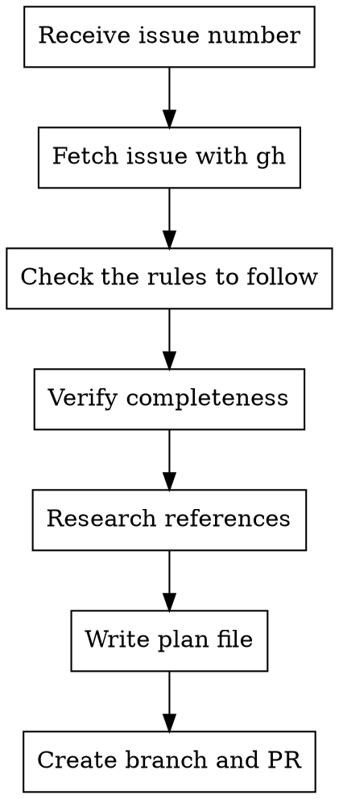

# Issue to PR

Convert a GitHub issue into an actionable PR with a plan that auto-triggers Claude execution.

## Workflow



## Steps

### 1. Parse Input

Extract issue number from argument:
- `123` → issue #123
- `https://github.com/owner/repo/issues/123` → issue #123
- `owner/repo#123` → issue #123 in owner/repo

### 2. Fetch Issue

```bash
gh issue view <number> --json title,body,labels,assignees
```

Present issue summary to user.

### 3. Verify Issue Completeness

Check that the issue template is fully filled out:
- For **[Model]** issues: A clear mathmatical definition, Type specification, Variables and fields, The complexity clarification, verify an existing solver can solve it, or a solving strategy is provided, A detailed example for human.
- For **[Rule]** issues: Source, Target, Reference to verify information, Implementable reduction algorithm, Test dataset generation method, Size overhead, A clear example for human.

Verify facts provided by the user, feel free to ask user questions. If any piece is missing or unclear, comment on the issue via `gh issue comment <number> --body "..."` to ask user clarify. Then stop and wait — do NOT proceed until the issue is complete.

### 4. Research References

Use `WebSearch` and `WebFetch` to look up the reference URL provided in the issue. This helps:
- Clarify the formal problem definition and notation
- Understand the reduction algorithm in detail (variable mapping, penalty terms, proof of correctness)
- Resolve any ambiguities in the issue description without bothering the contributor

If the reference is a paper or textbook, search for accessible summaries, lecture notes, or Wikipedia articles on the same reduction.

### 5. Write Plan

Write plan to `docs/plans/YYYY-MM-DD-<slug>.md` using `superpowers:writing-plans`.

The plan MUST include an **action pipeline** section with concrete steps based on issue type.

#### For `[Rule]` issues (A -> B reduction)

**Reference implementations — read these first:**
- Reduction rule: `src/rules/minimumvertexcover_maximumindependentset.rs`
- Unit test: `src/unit_tests/rules/minimumvertexcover_maximumindependentset.rs`
- Example program: `examples/reduction_minimumvertexcover_to_maximumindependentset.rs`
- Paper entry: search `docs/paper/reductions.typ` for `MinimumVertexCover` `MaximumIndependentSet`
- Traits: `src/rules/traits.rs`

**Action pipeline:**

1. **Implement reduction** — Create `src/rules/<source>_<target>.rs`:
   - `ReductionResult` struct + impl (`target_problem()` + `extract_solution()`)
   - `ReduceTo` impl with `#[reduction(...)]` macro (only `overhead` attribute needed)
   - `#[cfg(test)] #[path = ...]` linking to unit tests
   - Register in `src/rules/mod.rs`

2. **Write unit tests** — Create `src/unit_tests/rules/<source>_<target>.rs`:
   - Closed-loop test: create source → reduce → solve target → extract → verify
   - Edge cases

3. **Write example program** — Create `examples/reduction_<source>_to_<target>.rs`:
   - Must have `pub fn run()` + `fn main() { run() }`
   - Use regular comments (`//`), hardcode example name
   - Create, reduce, solve, extract, verify, export JSON
   - Register in `tests/suites/examples.rs`

4. **Document in paper** — Update `docs/paper/reductions.typ`:
   - Add `reduction-rule("Source", "Target", ...)` with proof sketch
   - Present example in tutorial style (see KColoring→QUBO section for reference)

5. **Regenerate graph** — `cargo run --example export_graph`

**Rules for solver implementation:**
- Make sure at least one solver is provided in the issue template. Check if the solving strategy is valid. If not, reply under issue to ask for clarification.
- If the solver uses integer programming, implement the model and ILP reduction rule together.
- Otherwise, ensure the information provided is enough to implement a solver.

**Rules for example writing:**
- Implement the user-provided example instance as an example program in `examples/`.
- Run the example; verify JSON output against user-provided information.
- Present in `docs/paper/reductions.typ` in tutorial style with clear intuition (see KColoring→QUBO section for reference).

#### For `[Model]` issues

**Reference implementations — read these first:**
- Optimization problem: `src/models/graph/maximum_independent_set.rs`
- Satisfaction problem: `src/models/satisfiability/sat.rs`
- Reference test: `src/unit_tests/models/graph/maximum_independent_set.rs`

**Action pipeline:**

1. **Implement model** — Create `src/models/<category>/<name>.rs`:
   - Struct definition, `Problem` impl, `OptimizationProblem` impl (if applicable)
   - Weight management via inherent methods (`weights()`, `set_weights()`, `is_weighted()`), not traits
   - Register in `src/models/<category>/mod.rs`

2. **Write tests** — Create `src/unit_tests/models/<category>/<name>.rs`:
   - Basic evaluation tests, serialization tests
   - Link via `#[path]`

3. **Document** — Update `docs/paper/reductions.typ`:
   - Add `display-name` entry
   - Add `#problem-def("Name")[definition...]`

### 6. Create PR
Create a pull request with only the plan file.

```bash
# Create branch
git checkout -b issue-<number>-<slug>

# Stage the plan file
git add docs/plans/<plan-file>.md

# Commit
git commit -m "Add plan for #<number>: <title>"

# Push
git push -u origin issue-<number>-<slug>

# Create PR
gh pr create --title "Fix #<number>: <title>" --body "

## Summary
<Brief description from brainstorming>

Closes #<number>"
```


## Example

```
User: /issue-to-pr 42

Claude: Let me fetch issue #42...

[Fetches issue: "[Rule] IndependentSet to QUBO"]
[Verifies all template sections are filled out]

All required info is present. I'll create the plan...

[Writes docs/plans/2026-02-09-independentset-to-qubo.md]
[Creates branch, commits, pushes]
[Creates PR]

Created PR #45: Fix #42: Add IndependentSet → QUBO reduction, description: ...
```

## Common Mistakes

| Mistake | Fix |
|---------|-----|
| Issue template incomplete | Ask contributor to fill in missing sections before proceeding |
| Including implementation code in initial PR | First PR: plan only |
| Generic plan | Use specifics from the issue |
