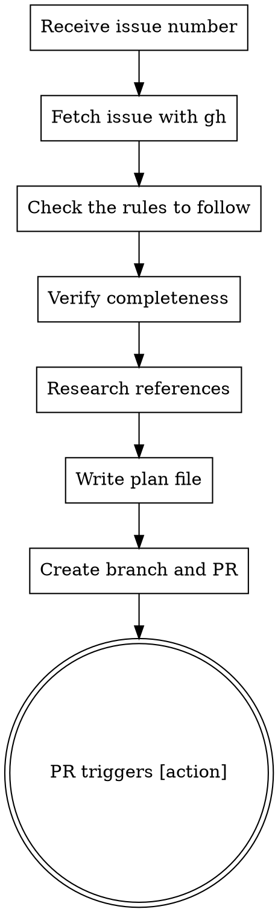

# Issue to PR

Convert a GitHub issue into an actionable PR with a plan that auto-triggers Claude execution.

## Usage

```
/issue-to-pr <issue-number-or-url>
```

## Workflow



## Steps

### 1. Parse Input

Extract issue number from argument:
- `123` → issue #123
- `https://github.com/owner/repo/issues/123` → issue #123
- `owner/repo#123` → issue #123 in owner/repo

### 2. Fetch Issue

```bash
gh issue view <number> --json title,body,labels,assignees
```

Present issue summary to user.

### 3. Verify Issue Completeness

Check that the issue template is fully filled out:
- For **[Model]** issues: Definition, Variables, Instance Data, Objective, Type Parameters, Example
- For **[Rule]** issues: Source, Target, Reference, Reduction mapping, Solution Extraction, Size Overhead, Example

If any section is missing or unclear, comment on the issue via `gh issue comment <number> --body "..."` asking the contributor to fill in the missing sections. Then stop and wait — do NOT proceed until the issue is complete.

### 4. Research References

Use `WebSearch` and `WebFetch` to look up the reference URL provided in the issue. This helps:
- Clarify the formal problem definition and notation
- Understand the reduction algorithm in detail (variable mapping, penalty terms, proof of correctness)
- Resolve any ambiguities in the issue description without bothering the contributor

If the reference is a paper or textbook, search for accessible summaries, lecture notes, or Wikipedia articles on the same reduction.

### 5. Write Plan

Write plan to `docs/plans/YYYY-MM-DD-<slug>.md` using `superpowers:writing-plans`:

### 6. Create PR

```bash
# Create branch
git checkout -b issue-<number>-<slug>

# Stage the plan file
git add docs/plans/<plan-file>.md

# Commit
git commit -m "Add plan for #<number>: <title>"

# Push
git push -u origin issue-<number>-<slug>

# Create PR with [action] at the BEGINNING
gh pr create --title "Fix #<number>: <title>" --body "[action]

## Summary
<Brief description from brainstorming>

Closes #<number>"
```

**CRITICAL:** The PR body MUST start with `[action]` on the first line. This triggers automated plan execution.

## Example

```
User: /issue-to-pr 42

Claude: Let me fetch issue #42...

[Fetches issue: "[Rule] IndependentSet to QUBO"]
[Verifies all template sections are filled out]

All required info is present. I'll create the plan...

[Writes docs/plans/2026-02-09-independentset-to-qubo.md]
[Creates branch, commits, pushes]
[Creates PR with body starting with "[action]"]

Created PR #45: Fix #42: Add IndependentSet → QUBO reduction
The [action] trigger will automatically execute the plan.
```

## Common Mistakes

| Mistake | Fix |
|---------|-----|
| Issue template incomplete | Ask contributor to fill in missing sections before proceeding |
| `[action]` not at start | PR body must BEGIN with `[action]` |
| Including implementation code in initial PR | First PR: plan only |
| Generic plan | Use specifics from the issue |
