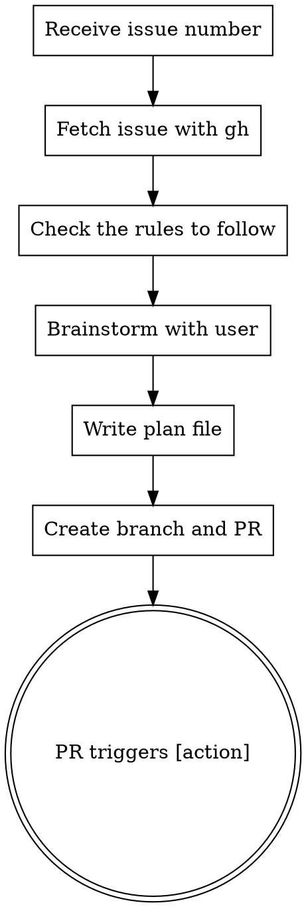

# Issue to PR

Convert a GitHub issue into an actionable PR with a plan that auto-triggers Claude execution.

## Usage

```
/issue-to-pr <issue-number-or-url>
```

## Workflow



## Steps

### 1. Parse Input

Extract issue number from argument:
- `123` → issue #123
- `https://github.com/owner/repo/issues/123` → issue #123
- `owner/repo#123` → issue #123 in owner/repo

### 2. Fetch Issue

```bash
gh issue view <number> --json title,body,labels,assignees
```

Present issue summary to user.

### 3. Brainstorm Solutions

**REQUIRED:** Invoke `superpowers:brainstorming` skill with the issue context (if superpowers plugin is available). Otherwise, conduct a manual brainstorming discussion with the user.

Brainstorming must cover:
- **User intent** — clarify what the issue is asking for
- **Multiple approaches** — explore 2-3 different implementation strategies
- **Implementation details** — discuss the mathematical formulation, data structures, variable mappings, constraint encodings, and any non-obvious design choices
- **Existing patterns** — read reference implementations in the codebase (e.g., `spinglass_qubo.rs` for reductions) to understand the conventions
- **Scope** — agree on which variants to implement (e.g., unweighted only, specific K values)

Do NOT skip brainstorming. Do NOT write a plan without user discussion.

### 4. Write Plan

After brainstorming concludes, write plan to `docs/plans/YYYY-MM-DD-<slug>.md` using `superpowers:writing-plans`:

### 5. Create PR

```bash
# Create branch
git checkout -b issue-<number>-<slug>

# Stage the plan file
git add docs/plans/<plan-file>.md

# Commit
git commit -m "Add plan for #<number>: <title>"

# Push
git push -u origin issue-<number>-<slug>

# Create PR with [action] at the BEGINNING
gh pr create --title "Fix #<number>: <title>" --body "[action]

## Summary
<Brief description from brainstorming>

Closes #<number>"
```

**CRITICAL:** The PR body MUST start with `[action]` on the first line. This triggers automated plan execution.

## Example

```
User: /issue-to-pr 42

Claude: Let me fetch issue #42...

[Fetches issue: "Add IndependentSet → QUBO reduction"]

I'll read the rules to follow in .claude/rules/adding-reductions.md and use superpowers:brainstorming to explore this with you.

[Invokes brainstorming - discusses approaches, user preferences, scope]

Based on our discussion, I'll create the plan with superpowers:writing-plans...

[Writes docs/plans/2026-02-09-independentset-to-qubo.md]
[Creates branch, commits, pushes]
[Creates PR with body starting with "[action]"]

Created PR #45: Fix #42: Add IndependentSet → QUBO reduction
The [action] trigger will automatically execute the plan.
```

## Common Mistakes

| Mistake | Fix |
|---------|-----|
| Skipping brainstorming | Always use superpowers:brainstorming (or manual discussion) first |
| `[action]` not at start | PR body must BEGIN with `[action]` |
| Including implementation code in initial PR | First PR: plan only |
| Generic plan | Use specifics from brainstorming |
