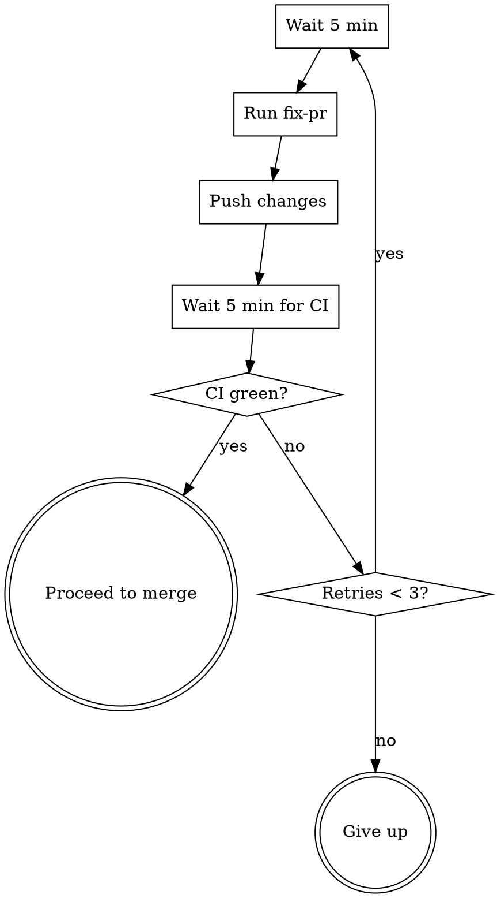

# Meta-Power

Batch-process open `[Model]` and `[Rule]` issues end-to-end: plan, implement, review, fix CI, and merge — fully autonomous.

## Overview

You are the **outer orchestrator**. For each issue you invoke existing skills and shell out to subprocesses. You never implement code directly — `make run-plan` does the heavy lifting in a separate Claude session.

## Step 0: Discover and Order Issues

```bash
# Fetch all open issues
gh issue list --state open --limit 50 --json number,title
```

Filter to issues whose title contains `[Model]` or `[Rule]`. Partition into two buckets, sort each by issue number ascending. Final order: **all Models first, then all Rules**.

Present the ordered list to the user for confirmation before starting:

```
Batch plan:
  Models:
    #108  [Model] LongestCommonSubsequence
    #103  [Model] SubsetSum
  Rules:
    #109  [Rule] LCS → MIS
    #110  [Rule] LCS → ILP
    #97   [Rule] BinPacking → ILP
    #91   [Rule] CVP → QUBO

Proceed? (user confirms)
```

Initialize a results table to track status for each issue.

## Step 1: Plan (issue-to-pr)

For the current issue:

```bash
git checkout main && git pull origin main
```

Invoke the `issue-to-pr` skill with the issue number. This creates a branch, writes a plan to `docs/plans/`, and opens a PR.

**If `issue-to-pr` fails** (e.g., incomplete issue template): record status as `skipped (plan failed)`, move to next issue.

Capture the PR number for later steps:
```bash
PR=$(gh pr view --json number --jq .number)
```

## Step 2: Execute (make run-plan)

Run the plan in a separate Claude subprocess:

```bash
make run-plan
```

This spawns a new Claude session (up to 500 turns) that reads the plan and implements it using `add-model` or `add-rule`.

**If the subprocess exits non-zero:** record status as `skipped (execution failed)`, move to next issue.

## Step 3: Review

After execution completes, ensure changes are committed and pushed:

```bash
# Check for uncommitted changes
git add -A && git diff --cached --quiet || git commit -m "Implement #<number>: <title>

Co-Authored-By: Claude Opus 4.6 <noreply@anthropic.com>"
git push
```

Request Copilot review:
```bash
make copilot-review
```

## Step 4: Fix Loop (max 3 retries)



For each retry:

1. **Wait 5 minutes** for Copilot review and CI to arrive:
   ```bash
   sleep 300
   ```

2. **Invoke `/fix-pr`** to address review comments, CI failures, and coverage gaps.

3. **Push fixes:**
   ```bash
   git push
   ```

4. **Wait 5 minutes** for CI to re-run:
   ```bash
   sleep 300
   ```

5. **Check CI status:**
   ```bash
   REPO=$(gh repo view --json nameWithOwner --jq .nameWithOwner)
   HEAD_SHA=$(gh api repos/$REPO/pulls/$PR | python3 -c "import sys,json; print(json.load(sys.stdin)['head']['sha'])")
   gh api repos/$REPO/commits/$HEAD_SHA/check-runs | python3 -c "
   import sys,json
   runs = json.load(sys.stdin)['check_runs']
   failed = [r['name'] for r in runs if r.get('conclusion') not in ('success', 'skipped', None)]
   pending = [r['name'] for r in runs if r.get('conclusion') is None and r['status'] != 'completed']
   if pending:
       print('PENDING: ' + ', '.join(pending))
   elif failed:
       print('FAILED: ' + ', '.join(failed))
   else:
       print('GREEN')
   "
   ```

   - If `GREEN`: break out of loop, proceed to merge.
   - If `PENDING`: wait another 2 minutes, re-check once.
   - If `FAILED`: increment retry counter, continue loop.

**After 3 failed retries:** record status as `fix-pr failed (3 retries)`, leave PR open, move to next issue.

## Step 5: Merge

```bash
gh pr merge $PR --squash --delete-branch
```

**If merge fails** (e.g., conflict): record status as `merge failed`, leave PR open, move to next issue.

## Step 6: Sync

Return to main for the next issue:

```bash
git checkout main && git pull origin main
```

This ensures the next issue (especially a Rule that depends on a just-merged Model) sees all prior work.

## Step 7: Report

After all issues are processed, print the summary table:

```
=== Meta-Power Batch Report ===

| Issue | Title                              | Status                    |
|-------|------------------------------------|---------------------------|
| #108  | [Model] LCS                        | merged                    |
| #103  | [Model] SubsetSum                  | merged                    |
| #109  | [Rule] LCS → MIS                  | merged                    |
| #110  | [Rule] LCS → ILP                  | fix-pr failed (3 retries) |
| #97   | [Rule] BinPacking → ILP           | merged                    |
| #91   | [Rule] CVP → QUBO                 | skipped (plan failed)     |

Completed: 4/6 | Skipped: 1 | Failed: 1
```

## Constants

| Name | Value | Rationale |
|------|-------|-----------|
| `MAX_RETRIES` | 3 | Most issues fix in 1-2 rounds |
| `CI_WAIT` | 5 min | GitHub Actions typical completion time |
| `PENDING_EXTRA_WAIT` | 2 min | One grace period for slow CI |

## Common Failure Modes

| Symptom | Cause | Mitigation |
|---------|-------|------------|
| `issue-to-pr` comments and stops | Issue template incomplete | Skip; user must fix the issue |
| `make run-plan` exits non-zero | Implementation too complex for 500 turns | Skip; needs manual work |
| CI red after 3 retries | Deep bug or flaky test | Leave PR open for human review |
| Merge conflict | Concurrent push to main | Leave PR open; manual rebase needed |
| Rule fails because model missing | Model issue was skipped earlier | Expected; skip rule too |
