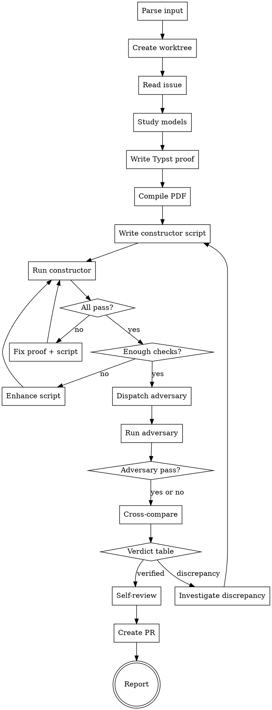

# Verify Reduction

End-to-end skill that takes a reduction rule issue, produces a verified mathematical proof with computational verification from two independent implementations, iterating until all checks pass. Creates a worktree, works in isolation, and submits a PR — following `issue-to-pr` conventions.

Outputs: Typst proof entry, constructor Python verification script, adversary Python verification script — all at PR #975 quality level.

## Invocation

```
/verify-reduction 868              # from a GitHub issue number
/verify-reduction SubsetSum Partition   # from source/target names
```

## Prerequisites

- `sympy`, `networkx`, and `hypothesis` installed (`pip install sympy networkx hypothesis`)
- Both source and target models must exist in the codebase (`pred show <Name>`)
- Optional: `elan` with Lean 4 toolchain (for formal lemmas — not required)

## Process



---

## Step 0: Parse Input and Create Worktree

### 0a. Parse input

```bash
REPO=$(gh repo view --json nameWithOwner --jq .nameWithOwner)
ISSUE=<number>
ISSUE_JSON=$(gh issue view "$ISSUE" --json title,body,number)
```

### 0b. Create worktree

```bash
REPO_ROOT=$(pwd)
BRANCH_JSON=$(python3 scripts/pipeline_worktree.py prepare-issue-branch \
  --issue "$ISSUE" --slug "verify-<source>-<target>" --base main --format json)
BRANCH=$(printf '%s\n' "$BRANCH_JSON" | python3 -c "import sys,json; print(json.load(sys.stdin)['branch'])")
WORKTREE_JSON=$(python3 scripts/pipeline_worktree.py enter --name "verify-$ISSUE" --format json)
WORKTREE_DIR=$(printf '%s\n' "$WORKTREE_JSON" | python3 -c "import sys,json; print(json.load(sys.stdin)['worktree_dir'])")
cd "$WORKTREE_DIR" && git checkout "$BRANCH"
```

If already inside a worktree, skip creation and use the current branch.

## Step 1: Read Issue and Study Models

```bash
gh issue view "$ISSUE" --json title,body
pred show <Source> --json
pred show <Target> --json
```

Extract: construction algorithm, correctness argument, overhead formulas, worked example, reference.

If the issue is incomplete, use WebSearch to find the original reference.

## Step 2: Write Typst Proof

Append to `docs/paper/proposed-reductions.typ` (or create a standalone `proposed-reductions-<ISSUE>.typ` if the main file is on another branch).

### MANDATORY structure

```typst
== Source $arrow.r$ Target <sec:source-target>

#theorem[...] <thm:source-target>

#proof[
  _Construction._ ...
  _Correctness._
  ($arrow.r.double$) ...
  ($arrow.l.double$) ...
  _Solution extraction._ ...
]

*Overhead.* (table)

*Feasible example.* (YES instance, fully worked)

*Infeasible example.* (NO instance, fully worked — show WHY no solution exists)
```

### HARD requirements

- **Construction**: numbered steps, every symbol defined before first use
- **Correctness**: genuinely independent ⟹ and ⟸ — NOT "the converse is similar"
- **No hand-waving**: ZERO instances of "clearly", "obviously", "it is easy to see", "straightforward"
- **No scratch work**: ZERO instances of "Wait", "Hmm", "Actually", "Let me try"
- **TWO examples minimum**: one YES instance (satisfiable/feasible) and one NO instance (unsatisfiable/infeasible). Both fully worked with numerical verification.
- **Example must be non-trivial**: the example must have ≥ 3 variables/vertices. A 1-variable or 2-vertex example is too degenerate to catch bugs.

Compile:
```bash
python3 -c "import typst; typst.compile('<file>.typ', output='<file>.pdf', root='.')"
```

## Step 3: Write Constructor Python Verification Script

Create `docs/paper/verify-reductions/verify_<source>_<target>.py`.

### ALL 7 sections are MANDATORY

```python
#!/usr/bin/env python3
"""§X.Y Source → Target (#NNN): exhaustive + structural verification."""
import itertools, sys
from sympy import symbols, simplify  # Section 1 is NOT optional

passed = failed = 0

def check(condition, msg=""):
    global passed, failed
    if condition: passed += 1
    else: failed += 1; print(f"  FAIL: {msg}")

def main():
    # === Section 1: Symbolic checks (sympy) — MANDATORY ===
    # At minimum: verify overhead formula symbolically for general n.
    # For algebraic reductions: verify key identities.
    # "The overhead is trivial" is NOT an excuse to skip this section.

    # === Section 2: Exhaustive forward + backward — MANDATORY ===
    # n ≤ 5 MINIMUM for all reduction types.
    # n ≤ 6 for identity/algebraic reductions.
    # Test ALL instances (or sample ≥ 300 per (n,m) if exhaustive is infeasible).

    # === Section 3: Solution extraction — MANDATORY ===
    # For EVERY feasible instance: extract source solution from target,
    # verify it satisfies the source problem.
    # This is the most commonly skipped section. DO NOT SKIP IT.

    # === Section 4: Overhead formula — MANDATORY ===
    # Build the actual target instance, measure its size fields,
    # compare against the overhead formula.

    # === Section 5: Structural properties — MANDATORY ===
    # Even for "trivial" reductions, verify at least:
    # - Target instance is well-formed (valid graph, valid formula, etc.)
    # - No degenerate cases (empty subsets, isolated vertices, etc.)
    # For gadget reductions: girth, connectivity, widget structure.

    # === Section 6: YES example from Typst — MANDATORY ===
    # Reproduce the exact numbers from the Typst proof's feasible example.

    # === Section 7: NO example from Typst — MANDATORY ===
    # Reproduce the exact numbers from the Typst proof's infeasible example.
    # Verify that both source and target are infeasible.

    print(f"Source → Target: {passed} passed, {failed} failed")
    return 1 if failed else 0

if __name__ == "__main__":
    sys.exit(main())
```

### Minimum check counts — STRICTLY ENFORCED

| Type | Minimum checks | Minimum n | Strategy |
|------|---------------|-----------|----------|
| Identity (same graph, different objective) | 10,000 | n ≤ 6 | Exhaustive ALL graphs |
| Algebraic (padding, complement, De Morgan) | 10,000 | n ≤ 5 | Symbolic + exhaustive |
| Gadget (widget, cycle construction) | 5,000 | n ≤ 5 | Construction + formula + structural |
| Composition (A→B→C) | 10,000 | n ≤ 5 | Exhaustive per step |

Every reduction gets at least 5,000 checks and n ≤ 5 exhaustive testing regardless of perceived simplicity.

## Step 4: Run and Iterate

```bash
python3 docs/paper/verify-reductions/verify_<source>_<target>.py
```

### Iteration 1: First run

Run the script. Fix any failures. Re-run.

### Iteration 2: Check count audit — STRICT

Print this table and fill it in honestly:

```
CHECK COUNT AUDIT:
  Total checks:          ___ (minimum: 5,000)
  Forward direction:     ___ instances tested (minimum: all n ≤ 5)
  Backward direction:    ___ instances tested (minimum: all n ≤ 5)
  Solution extraction:   ___ feasible instances tested
  Overhead formula:      ___ instances compared
  Symbolic (sympy):      ___ identities verified
  YES example:           verified? [yes/no]
  NO example:            verified? [yes/no]
  Structural properties: ___ checks
```

If ANY line is below minimum, enhance the script and re-run. Do NOT proceed.

### Iteration 3: Gap analysis — MANDATORY

List EVERY claim in the Typst proof. For each, state whether it's tested:

```
CLAIM                                    TESTED BY
"Universe has 2n elements"               Section 4: overhead formula ✓
"Complementarity forces consistency"     Section 3: extraction ✓
"Clause subset is non-monochromatic"     Section 2: forward direction ✓
"No clause is all-true or all-false"     Section 2: backward direction ✓
...
```

If any claim has no test, add one. If it's untestable, document WHY.

### Iteration 4: Export test vectors and validate Typst matching — MANDATORY

After all checks pass and gap analysis is complete, the constructor script must export a test vectors JSON file for downstream consumption by `/add-reduction`:

**File:** `docs/paper/verify-reductions/test_vectors_<source>_<target>.json`

```json
{
  "source": "<Source>",
  "target": "<Target>",
  "issue": "<ISSUE_NUMBER>",
  "yes_instance": {
    "input": { "...problem-specific fields..." },
    "output": { "...reduced instance fields..." },
    "source_feasible": true,
    "target_feasible": true,
    "source_solution": ["...config..."],
    "extracted_solution": ["...config..."]
  },
  "no_instance": {
    "input": { "...problem-specific fields..." },
    "output": { "...reduced instance fields..." },
    "source_feasible": false,
    "target_feasible": false
  },
  "overhead": {
    "field_name": "expression using source getters"
  },
  "claims": [
    {"tag": "claim_tag", "formula": "formula or description", "verified": true}
  ]
}
```

Add this export at the end of `main()` in the constructor script:

```python
import json

test_vectors = {
    "source": "<Source>",
    "target": "<Target>",
    "issue": <ISSUE>,
    "yes_instance": { ... },   # from Section 6
    "no_instance": { ... },    # from Section 7
    "overhead": { ... },       # from Section 1/4
    "claims": claims_list,     # accumulated claim() calls
}

with open("docs/paper/verify-reductions/test_vectors_<source>_<target>.json", "w") as f:
    json.dump(test_vectors, f, indent=2)
print(f"Test vectors exported to test_vectors_<source>_<target>.json")
```

**Typst ↔ JSON cross-check:**

After exporting, load both the test vectors JSON and the Typst file. For each key numerical value in the JSON (input sizes, target values, output sizes), check that it appears as a substring in the Typst YES/NO example sections. This is a substring search on the raw Typst text — not a full parser:

```python
typst_text = open("<typst_file>").read()
for val in [str(v) for v in yes_instance["input"].values() if isinstance(v, (int, list))]:
    assert str(val) in typst_text, f"Typst missing YES value: {val}"
for val in [str(v) for v in no_instance["input"].values() if isinstance(v, (int, list))]:
    assert str(val) in typst_text, f"Typst missing NO value: {val}"
```

If any value is missing, the Typst proof and Python script are out of sync — fix before proceeding.

**Structured claims (best-effort replacement for manual gap analysis):**

Instead of the manual CLAIM/TESTED BY table, accumulate claims programmatically:

```python
claims_list = []

def claim(tag, formula_or_desc, verified=True):
    claims_list.append({"tag": tag, "formula": formula_or_desc, "verified": verified})
```

Call `claim()` throughout the constructor script wherever a Typst proof claim is verified. The self-review step (Step 6) checks that all claims have `verified: true` and that the claim count is reasonable (at least 5 claims for any non-trivial reduction).

## Step 5: Adversary Verification

The adversary step provides independent verification by a second agent that implements the reduction from scratch, using only the Typst proof as specification. This catches bugs that the constructor's own tests cannot find (confirmation bias, shared implementation errors).

### 5a. Dispatch adversary agent

Launch a subagent with the following prompt template. The adversary must not see the constructor's Python script — it reads only the Typst proof.

**Adversary prompt:**

````
You are an adversary verifier for a mathematical reduction proof.

Your goal: independently implement and test the reduction described in the Typst
proof below, trying to find bugs. You have no access to the constructor's
implementation. Write your own from scratch based solely on the mathematical
specification.

## Input

Typst proof file: docs/paper/proposed-reductions.typ (section on <Source> → <Target>)
Issue: #<ISSUE>

## Reduction type

Detect the reduction type from the Typst proof and tailor your testing focus:

- **Identity reduction** (same graph/structure, different objective — keywords: "complement", "same graph", "negation"): Focus on exhaustive enumeration of all source instances for n ≤ 6. Test every possible configuration. Edge-case configs (all-zero, all-one, alternating) are highest priority.

- **Algebraic reduction** (padding, case split, formula transformation — keywords: "padding", "case", "if Σ", "d ="): Focus on case boundary conditions. Test instances where the case selection changes (e.g., Σ = 2T exactly, Σ = 2T ± 1). Verify extraction logic for each case independently. Include at least one hypothesis strategy targeting boundary values.

- **Gadget reduction** (widget/component construction — keywords: "widget", "component", "gadget", "cover-testing"): Focus on widget structure invariants. Verify each traversal/usage pattern independently. Test that interior vertices/elements have no external connections. Check structural properties (connectivity, edge counts, degree sequences) across all small instances.

## Your task

1. Read the Typst proof carefully. Extract:
   - The construction algorithm (how to build the target instance)
   - The correctness argument (forward and backward directions)
   - The solution extraction procedure
   - The overhead formula
   - The YES and NO examples

2. Create `docs/paper/verify-reductions/adversary_<source>_<target>.py` with:
   - Your own `reduce()` function implementing the construction from scratch
   - Your own `extract_solution()` function implementing solution extraction
   - Your own `is_feasible_source()` and `is_feasible_target()` validators
   - Exhaustive testing for n ≤ 5 (forward + backward + extraction)
   - Overhead formula verification
   - Reproduction of both Typst examples (YES and NO)
   - Property-based testing using `hypothesis` (at least 2 strategies)
   - Minimum 5,000 total checks

3. Use `hypothesis` for property-based testing. Example strategies:
   ```python
   from hypothesis import given, settings
   from hypothesis import strategies as st

   @given(st.lists(st.integers(0, 1), min_size=3, max_size=8))
   @settings(max_examples=500)
   def test_roundtrip(assignment):
       # Build source from assignment, reduce, check equivalence
       ...
   ```

4. Run the script. Report pass/fail counts and any bugs found.

5. Do NOT read or import from `verify_<source>_<target>.py`. Your implementation
   must be independent.

## Output format

Print at the end:
```
ADVERSARY: <Source> → <Target>: N passed, M failed
BUGS FOUND: <list or "none">
```
````

### 5b. Run adversary script

```bash
python3 docs/paper/verify-reductions/adversary_<source>_<target>.py
```

### 5c. Cross-comparison

After both scripts have run, compare their `reduce()` outputs on a shared set of instances. Create and run this comparison inline:

```python
#!/usr/bin/env python3
"""Cross-compare constructor and adversary implementations."""
import sys
sys.path.insert(0, "docs/paper/verify-reductions")

from verify_<source>_<target> import reduce as constructor_reduce
from adversary_<source>_<target> import reduce as adversary_reduce

# Also import feasibility checkers from both sides
from verify_<source>_<target> import is_feasible_source, is_feasible_target
from adversary_<source>_<target> import (
    is_feasible_source as adv_is_feasible_source,
    is_feasible_target as adv_is_feasible_target,
)

def normalize(target_instance):
    """Convert target instance to a canonical hashable form for comparison.
    Adapt this to the specific target problem type."""
    # For graph problems: sorted edge list + vertex count
    # For formula problems: sorted clause list
    # For set problems: frozenset of frozensets
    return tuple(sorted(str(x) for x in target_instance))

agree = disagree = 0
feasibility_mismatch = 0

# Generate shared test instances (adapt to source problem type)
import itertools
for n in range(3, 6):
    for instance in generate_all_instances(n):  # problem-specific generator
        c_target = constructor_reduce(instance)
        a_target = adversary_reduce(instance)

        # Compare structural equivalence
        if normalize(c_target) == normalize(a_target):
            agree += 1
        else:
            disagree += 1
            print(f"  DISAGREE on instance {instance}")
            print(f"    Constructor: {c_target}")
            print(f"    Adversary:   {a_target}")

        # Compare feasibility verdicts
        c_feas = is_feasible_target(c_target)
        a_feas = adv_is_feasible_target(a_target)
        if c_feas != a_feas:
            feasibility_mismatch += 1
            print(f"  FEASIBILITY MISMATCH on {instance}: "
                  f"constructor={c_feas}, adversary={a_feas}")

print(f"\nCross-comparison: {agree} agree, {disagree} disagree, "
      f"{feasibility_mismatch} feasibility mismatches")
if disagree > 0 or feasibility_mismatch > 0:
    print("ACTION REQUIRED: investigate discrepancies before proceeding")
    sys.exit(1)
```

Adapt the `normalize()` function and instance generator to the specific source/target problem types.

### 5d. Verdict criteria

Use this table to determine the outcome. All three signals must be considered together:

| Constructor | Adversary | Cross-comparison | Verdict | Action |
|-------------|-----------|-----------------|---------|--------|
| Pass | Pass | Agree | Verified | Proceed to Step 6 |
| Pass | Pass | Disagree | Suspect | Both produce valid but structurally different targets. Investigate whether both are correct reductions (e.g., isomorphic gadgets) or one has a latent bug. Resolve before proceeding. |
| Pass | Fail | Agree | Adversary bug | Review adversary script for implementation errors. If adversary misread the Typst spec, fix spec clarity and re-run adversary. |
| Pass | Fail | Disagree | Suspect | Constructor may have a bug masked by its own tests. Investigate the disagreeing instances manually. |
| Fail | Pass | Agree | Constructor bug | Fix constructor script, re-run from Step 4. |
| Fail | Pass | Disagree | Suspect | Investigate both — the agreeing instances may be coincidental. |
| Fail | Fail | Agree | Proof bug | The reduction itself is likely wrong. Re-examine the Typst proof. Return to Step 2. |
| Fail | Fail | Disagree | Proof bug | Same as above — shared failures with structural disagreement indicate a fundamental problem. |

When the verdict is "Suspect," the resolution is to manually inspect the disagreeing instances until the root cause is identified, then loop back to the appropriate step.

## Step 6: Self-Review

Before declaring verified, run through this checklist. Every item must be YES. If any is NO, go back and fix it.

### Typst proof

- [ ] Compiles without errors
- [ ] Has Construction with numbered steps
- [ ] Has Correctness with independent ⟹ and ⟸ paragraphs
- [ ] Has Solution extraction
- [ ] Has Overhead table with formula
- [ ] Has YES example (feasible, ≥ 3 variables/vertices, fully worked)
- [ ] Has NO example (infeasible, fully worked with explanation of WHY infeasible)
- [ ] Zero instances of "clearly", "obviously", "it is easy to see"
- [ ] Zero instances of "Wait", "Hmm", "Actually", scratch work
- [ ] Every symbol defined before first use

### Constructor Python script

- [ ] 0 failures
- [ ] ≥ 5,000 total checks
- [ ] Section 1 (symbolic) present and non-empty
- [ ] Section 2 (exhaustive) covers n ≤ 5 minimum
- [ ] Section 3 (extraction) tests EVERY feasible instance
- [ ] Section 4 (overhead) compares formula vs actual for all tested instances
- [ ] Section 5 (structural) has at least one non-trivial check
- [ ] Section 6 (YES example) reproduces Typst example numbers exactly
- [ ] Section 7 (NO example) reproduces Typst infeasible example exactly
- [ ] Gap analysis performed — every Typst claim has a corresponding test

### Adversary Python script

- [ ] 0 failures
- [ ] ≥ 5,000 total checks
- [ ] Implemented independently (no imports from constructor script)
- [ ] Uses `hypothesis` property-based testing (at least 2 strategies)
- [ ] Exhaustive testing for n ≤ 5
- [ ] Reproduces both Typst examples

### Cross-consistency

- [ ] Cross-comparison script ran with 0 disagreements
- [ ] Cross-comparison script ran with 0 feasibility mismatches
- [ ] The constructor script's `reduce()` implements the Typst construction
- [ ] The adversary script's `reduce()` implements the Typst construction independently
- [ ] The overhead formula in both scripts matches the Typst overhead table
- [ ] The examples in both scripts match the Typst examples (same numbers, same instances)

### Test vectors and auto-matching

- [ ] `test_vectors_<source>_<target>.json` exported successfully
- [ ] YES instance in JSON matches Typst feasible example (values present)
- [ ] NO instance in JSON matches Typst infeasible example (values present)
- [ ] All claims have `verified: true`
- [ ] At least 5 claims for non-trivial reductions

### Lean (optional)

If Lean lemmas were added:

- [ ] Builds without errors (warnings OK)
- [ ] At least one non-trivial lemma (not just `rfl` or `omega` on a tautology)
- [ ] Every `sorry` has a comment explaining WHY

## Step 7: Report

```
=== Verification Report: Source → Target (#NNN) ===

Typst proof: <file> §X.Y
  - Construction: ✓ (N steps)
  - Correctness: ✓ (⟹ + ⟸)
  - Extraction: ✓
  - Overhead: ✓
  - YES example: ✓ (N vars/vertices)
  - NO example: ✓ (N vars/vertices, reason: ...)

Constructor: verify_<source>_<target>.py
  - Checks: N passed, 0 failed
  - Sections: 1(sympy) 2(exhaustive) 3(extraction) 4(overhead) 5(structural) 6(YES) 7(NO)
  - Forward: exhaustive n ≤ K
  - Backward: exhaustive n ≤ K
  - Gap analysis: all claims covered

Adversary: adversary_<source>_<target>.py
  - Checks: N passed, 0 failed
  - Property-based: M hypothesis examples
  - Forward: exhaustive n ≤ K
  - Backward: exhaustive n ≤ K
  - Bugs found: <list or "none">

Cross-comparison:
  - Instances compared: N
  - Structural agreement: N/N
  - Feasibility agreement: N/N

Lean: <file>.lean (optional)
  - Non-trivial lemmas: N
  - Trivial lemmas: M
  - Sorry: J (with justification)

Bugs found: <list or "none">
Iterations: N rounds

Verdict: VERIFIED / OPEN (with reason)
```

## Step 8: Commit, Create PR, Clean Up

### 8a. Commit

```bash
git add docs/paper/<typst-file>.typ \
       docs/paper/verify-reductions/verify_*.py \
       docs/paper/verify-reductions/adversary_*.py \
       docs/paper/verify-reductions/test_vectors_*.json
git add -f docs/paper/<typst-file>.pdf
git commit -m "docs: /verify-reduction #<ISSUE> — <Source> → <Target> VERIFIED

Typst: Construction + Correctness + Extraction + Overhead + YES/NO examples
Constructor: N checks, 0 failures (exhaustive n ≤ K, 7 sections)
Adversary: M checks, 0 failures (independent impl + hypothesis)
Cross-comparison: all instances agree

Co-Authored-By: Claude Opus 4.6 (1M context) <noreply@anthropic.com>"
```

### 8b. Push and create PR

```bash
git push -u origin "$BRANCH"
gh pr create --title "docs: verify reduction #<ISSUE> — <Source> → <Target>" --body "..."
```

### 8c. Clean up worktree

```bash
cd "$REPO_ROOT"
python3 scripts/pipeline_worktree.py cleanup --worktree "$WORKTREE_DIR"
```

### 8d. Comment on issue

```bash
gh issue comment "$ISSUE" --body "verify-reduction report: VERIFIED (PR #<N>)..."
```

## Quality Gates

A reduction is **VERIFIED** when ALL of these hold:

- [ ] Typst compiles, has all mandatory sections including YES and NO examples
- [ ] Zero hand-waving language
- [ ] Constructor Python has 0 failures and ≥ 5,000 checks
- [ ] All 7 constructor Python sections present and non-empty
- [ ] Adversary Python has 0 failures and ≥ 5,000 checks
- [ ] Adversary Python uses `hypothesis` property-based testing
- [ ] Adversary implementation is independent (no shared code with constructor)
- [ ] Exhaustive n ≤ 5 minimum (both scripts)
- [ ] Solution extraction verified for all feasible instances
- [ ] Overhead formula matches actual construction
- [ ] Both Typst examples reproduced by both scripts
- [ ] Gap analysis shows all Typst claims tested
- [ ] Cross-comparison shows 0 disagreements and 0 feasibility mismatches
- [ ] Cross-consistency between Typst, constructor, and adversary verified
- [ ] Test vectors JSON exported with YES/NO instances, overhead, and claims
- [ ] Typst ↔ JSON auto-matching passed (key values present in Typst text)

If any gate fails, go back and fix it before declaring the reduction verified.

## Common Mistakes

| Mistake | Consequence |
|---------|-------------|
| Adversary imports from constructor script | Rejected — must be independent |
| No property-based testing in adversary | Rejected — add hypothesis strategies |
| No symbolic checks (Section 1 empty) | Rejected — add sympy verification |
| Only YES example, no NO example | Rejected — add infeasible instance |
| n ≤ 3 or n ≤ 4 "because it's simple" | Rejected — minimum n ≤ 5 |
| "Passed on first run" without gap analysis | Rejected — perform gap analysis |
| Example has < 3 variables | Rejected — too degenerate |
| Either script has < 5,000 checks | Rejected — enhance exhaustive testing |
| Extraction not tested | Rejected — add Section 3 |
| Typst proof says "clearly" | Rejected — rewrite without hand-waving |
| Cross-comparison skipped | Rejected — run comparison script |
| Disagreements dismissed without investigation | Rejected — resolve every discrepancy |

## Integration

### Pipeline: Issue → verify-reduction → add-reduction → review-pipeline

`/verify-reduction` is a **pre-verification gate**. The Python `reduce()` function is the verified spec. `/add-reduction` translates it to Rust. `/review-pipeline`'s agentic test confirms the Rust matches.

- **Before `/add-reduction`**: `/verify-reduction` produces Typst proof + Python scripts + test vectors JSON
- **During `/add-reduction`**: reads Python `reduce()` as pseudocode, overhead from test vectors JSON, generates Rust tests from test vectors
- **During `/review-pipeline`**: agentic test runs `pred reduce`/`pred solve` on test vector instances; compositional check via alternative paths if available

### Standalone usage

- **After `write-rule-in-paper`**: invoke to verify paper entry
- **During `review-structural`**: check verification script exists and passes
- **Before `issue-to-pr --execute`**: pre-validate the algorithm

## Reference: PR #975 Quality Level

Target quality defined by PR #975:
- 800,000+ total checks, 0 unexpected failures
- 3 bugs caught through iteration loop
- Every script has forward + backward + extraction + overhead + example
- Two independent implementations agreeing on all test instances
- Failures marked OPEN honestly with diagnosis
