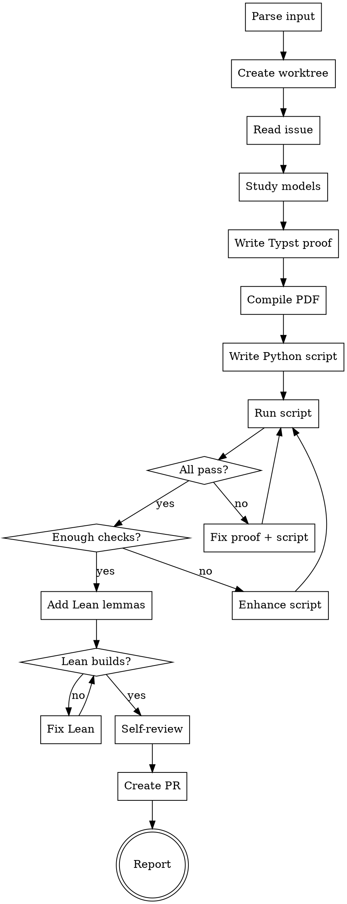

# Verify Reduction

End-to-end skill that takes a reduction rule issue, produces a verified mathematical proof with computational and formal verification, iterating until all checks pass. Creates a worktree, works in isolation, and submits a PR — following `issue-to-pr` conventions.

Outputs: Typst proof entry, Python verification script, Lean lemmas — all at PR #975 quality level.

## Invocation

```
/verify-reduction 868              # from a GitHub issue number
/verify-reduction SubsetSum Partition   # from source/target names
```

## Prerequisites

- `sympy` and `networkx` installed (`pip install sympy networkx`)
- Both source and target models must exist in the codebase (`pred show <Name>`)
- For Lean: `elan` installed with Lean 4 toolchain

## Process



---

## Step 0: Parse Input and Create Worktree

### 0a. Parse input

Extract issue number or source/target names:
- `868` → issue #868, fetch title to get Source → Target
- `SubsetSum Partition` → search for matching open issue, or proceed without issue number

```bash
REPO=$(gh repo view --json nameWithOwner --jq .nameWithOwner)
ISSUE=<number>
ISSUE_JSON=$(gh issue view "$ISSUE" --json title,body,number)
```

### 0b. Create worktree

Follow `issue-to-pr` conventions for isolated work:

```bash
REPO_ROOT=$(pwd)

# Create or reuse issue branch
BRANCH_JSON=$(python3 scripts/pipeline_worktree.py prepare-issue-branch \
  --issue "$ISSUE" \
  --slug "verify-<source>-<target>" \
  --base main \
  --format json)
BRANCH=$(printf '%s\n' "$BRANCH_JSON" | python3 -c "import sys,json; print(json.load(sys.stdin)['branch'])")

# Enter worktree
WORKTREE_JSON=$(python3 scripts/pipeline_worktree.py enter \
  --name "verify-$ISSUE" \
  --format json)
WORKTREE_DIR=$(printf '%s\n' "$WORKTREE_JSON" | python3 -c "import sys,json; print(json.load(sys.stdin)['worktree_dir'])")
cd "$WORKTREE_DIR"
git checkout "$BRANCH"
```

If already inside a worktree (CWD under `.worktrees/`), skip worktree creation and use the current branch.

All subsequent steps work in the worktree. At the end, a PR is created and the worktree is cleaned up.

## Step 1: Read Issue and Study Models

Read the GitHub issue body:
```bash
gh issue view "$ISSUE" --json title,body
```

Study both models:
```bash
pred show <Source> --json
pred show <Target> --json
```

Extract from the issue:
- Construction algorithm (numbered steps)
- Correctness argument (forward + backward)
- Overhead formulas
- Worked example
- Reference (Garey & Johnson entry, paper citation)

If the issue is incomplete (missing algorithm, placeholder text), use WebSearch to find the original reference and reconstruct the algorithm.

## Step 2: Write Typst Proof

Append a new section to `docs/paper/proposed-reductions.typ`:

```typst
== Source $arrow.r$ Target <sec:source-target>

#theorem[
  One-sentence intuition. Reference: citation.
] <thm:source-target>

#proof[
  _Construction._ Given a Source instance ...:
  + Step 1.
  + Step 2.
  ...

  _Correctness._

  ($arrow.r.double$) Forward direction proof. $checkmark$

  ($arrow.l.double$) Backward direction proof. $checkmark$

  _Solution extraction._ How to map target solution back to source.
]

*Overhead.*

#table(
  columns: (1fr, 1fr),
  table.header([Target metric], [Expression]),
  [`field_name`], [formula],
)

*Example.* Concrete instance with full numerical verification. $checkmark$
```

### Quality requirements for the Typst proof

- **Construction**: numbered steps, all symbols defined before use
- **Correctness**: genuinely independent ⟹ and ⟸ paragraphs (not "symmetric")
- **No hand-waving**: no "clearly", "obviously", "it is easy to see"
- **No scratch work**: no "Wait", "Hmm", "Actually", failed attempts
- **Example**: small enough to verify by hand, large enough that a wrong construction would give a wrong answer

Compile after writing:
```bash
python3 -c "import typst; typst.compile('docs/paper/proposed-reductions.typ', output='docs/paper/proposed-reductions.pdf', root='.')"
```

## Step 3: Write Python Verification Script

Create `docs/paper/verify-reductions/verify_<source>_<target>.py`.

### Mandatory sections

```python
#!/usr/bin/env python3
"""§X.Y Source → Target (#NNN): exhaustive + structural verification."""
import itertools, sys

passed = failed = 0

def check(condition, msg=""):
    global passed, failed
    if condition: passed += 1
    else: failed += 1; print(f"  FAIL: {msg}")

def main():
    # === Section 1: Symbolic checks (sympy) ===
    # Verify key algebraic identities for general n.
    # E.g., padding algebra, complement identity, De Morgan.

    # === Section 2: Exhaustive forward + backward ===
    # For ALL instances up to n=5 or n=6:
    #   source_feasible = check_source(instance)
    #   target = reduce(instance)
    #   target_feasible = check_target(target)
    #   check(source_feasible == target_feasible)

    # === Section 3: Solution extraction ===
    # For feasible instances: extract source solution from target solution,
    # verify extracted solution actually satisfies the source problem.

    # === Section 4: Overhead formula ===
    # Build the actual target, compare sizes against formula.

    # === Section 5: Structural properties ===
    # Girth, connectivity, widget edges, cycle analysis, etc.

    # === Section 6: Paper example ===
    # Verify the specific worked example from the Typst note.

    print(f"Source → Target: {passed} passed, {failed} failed")
    return 1 if failed else 0

if __name__ == "__main__":
    sys.exit(main())
```

### Minimum check counts by reduction type

| Type | Minimum checks | Strategy |
|------|---------------|----------|
| Identity (same graph) | 10,000 | Exhaustive ALL graphs n≤6 |
| Algebraic (padding, complement) | 20,000 | Symbolic + exhaustive n≤6 |
| Gadget (widget, cycle) | 5,000 | Construction + formula + small HC/HP |
| Composition (A→B→C) | 10,000 | Exhaustive per step, ALL graphs n≤5 |
| Trivial (De Morgan, identity) | 5,000 | Exhaustive n≤4, all formula sizes |

## Step 4: Run and Iterate (THE CRITICAL LOOP)

```bash
python3 docs/paper/verify-reductions/verify_<source>_<target>.py
```

**This is the core of the skill.** Iterate until convergence:

### Iteration 1: First run

Run the script. Expect failures — the first draft usually has bugs.

**If forward/backward fails**: the construction is wrong. Fix the Typst proof AND the script. Re-run.

**If extraction fails**: the `extract_solution` logic is wrong. Fix the Typst proof's extraction section. Re-run.

**If overhead fails**: the formula doesn't match the actual construction. Fix the formula in the Typst overhead table. Re-run.

**If the construction is fundamentally broken** (like X3C→AP): mark the Typst entry as OPEN in red. Document the failure mode in the script. Do NOT pretend it works.

### Iteration 2: Check count audit

After 0 failures, audit the check counts:

```
Is the check count ≥ minimum for this reduction type?
Are forward AND backward tested?
Is solution extraction tested?
Is the overhead formula tested against actual construction?
Is the paper example numerically verified?
```

If any answer is "no", enhance the script and re-run.

### Iteration 3: Gap analysis

Ask: "What is NOT tested?" For each untested claim:
- Can it be tested? → Add a test section
- Too expensive to test? → Document what's tested vs what's proved
- Structural property? → Add networkx girth/connectivity check

Re-run until the gap analysis finds nothing actionable.

## Step 5: Add Lean Lemmas

Append to `docs/paper/verify-reductions/lean/ReductionProofs/Basic.lean`:

### Required (every reduction)

```lean
/-- Overhead arithmetic for Source → Target. -/
theorem source_target_overhead (n m : ℕ) :
    <formula LHS> = <formula RHS> := by omega
```

### Recommended (when Mathlib supports it)

- **Structural invariant**: e.g., `G ⊔ Gᶜ = ⊤` for complement reductions
- **Problem type**: `inductive` type for gadget vertices with `DecidableEq`, `Fintype`
- **Key identity**: e.g., `Finset.sum_union` for edge-set decomposition

### Build

```bash
cd docs/paper/verify-reductions/lean
export PATH="$HOME/.elan/bin:$PATH"
lake build
```

`sorry` is acceptable for lemmas needing Mathlib infrastructure that doesn't exist. Document WHY in a comment above the `sorry`.

## Step 6: Self-Review

Before declaring verified, check:

1. **Does the Typst proof match the Python script?** The script should implement exactly the construction described in the proof. If they diverge, one is wrong.

2. **Does the paper example pass?** The specific numbers in the worked example must be reproduced by the script.

3. **Are there any `FAIL` lines in the script output?** Even one failure means the reduction is NOT verified.

4. **Is the Lean build clean?** Warnings are OK (unused variables). Errors are not.

## Step 7: Report

Output:

```
=== Verification Report: Source → Target (#NNN) ===

Typst proof: docs/paper/proposed-reductions.typ §X.Y
  - Construction: ✓ (N steps)
  - Correctness: ✓ (⟹ + ⟸)
  - Extraction: ✓
  - Overhead: ✓
  - Example: ✓

Python: docs/paper/verify-reductions/verify_<source>_<target>.py
  - Checks: N passed, 0 failed
  - Forward: exhaustive n ≤ K
  - Backward: exhaustive n ≤ K
  - Extraction: verified
  - Overhead: verified
  - Example: verified

Lean: docs/paper/verify-reductions/lean/ReductionProofs/Basic.lean
  - Lemmas proved: N
  - Sorry: M (with justification)

Bugs found during verification:
  - [list or "none"]

Iterations: N rounds to reach 0 failures

Verdict: VERIFIED / OPEN (with reason)
```

## Step 8: Commit, Create PR, Clean Up

### 8a. Commit all artifacts together

```bash
git add docs/paper/proposed-reductions.typ \
       docs/paper/verify-reductions/verify_<source>_<target>.py \
       docs/paper/verify-reductions/lean/ReductionProofs/Basic.lean
git add -f docs/paper/proposed-reductions.pdf  # PDF is gitignored

git commit -m "$(cat <<'COMMIT_EOF'
docs: /verify-reduction #<ISSUE> — <Source> → <Target> VERIFIED

Typst proof: §X.Y with Construction + Correctness + Extraction + Overhead + Example
Python: N checks, 0 failures (exhaustive n ≤ K)
Lean: M lemmas proved

Bugs found: <list or "none">
Iterations: N rounds

Co-Authored-By: Claude Opus 4.6 (1M context) <noreply@anthropic.com>
COMMIT_EOF
)"
```

### 8b. Push and create PR

```bash
git push -u origin "$BRANCH"

gh pr create \
  --title "docs: verify reduction #<ISSUE> — <Source> → <Target>" \
  --body "$(cat <<'PR_EOF'
## Summary

Mathematical verification of the <Source> → <Target> reduction (#<ISSUE>).

**Typst proof:** `docs/paper/proposed-reductions.typ` §X.Y
- Construction + Correctness (⟹/⟸) + Extraction + Overhead + Example

**Python verification:** `docs/paper/verify-reductions/verify_<source>_<target>.py`
- N checks, 0 failures
- Forward + backward exhaustive n ≤ K

**Lean lemmas:** `docs/paper/verify-reductions/lean/ReductionProofs/Basic.lean`
- M lemmas proved, J sorry

## Test plan
- [ ] `python3 docs/paper/verify-reductions/verify_<source>_<target>.py` passes
- [ ] `cd docs/paper/verify-reductions/lean && lake build` succeeds
- [ ] PDF compiles without errors

🤖 Generated with [Claude Code](https://claude.com/claude-code)
PR_EOF
)"
```

### 8c. Clean up worktree

```bash
cd "$REPO_ROOT"
python3 scripts/pipeline_worktree.py cleanup --worktree "$WORKTREE_DIR"
```

### 8d. Comment on issue

```bash
gh issue comment "$ISSUE" --body "$(cat <<'COMMENT_EOF'
## verify-reduction report

**Verdict: VERIFIED**

- Typst proof: §X.Y in `proposed-reductions.typ` (PR #<PR_NUMBER>)
- Python: N checks, 0 failures
- Lean: M lemmas proved
- Bugs found: <list or "none">

Script: `docs/paper/verify-reductions/verify_<source>_<target>.py`
COMMENT_EOF
)"
```

Print the PR URL when done.

## Quality Gates

A reduction is **VERIFIED** when ALL of these hold:

- [ ] Typst proof compiles without errors
- [ ] Typst proof has Construction + Correctness (⟹/⟸) + Extraction + Overhead + Example
- [ ] No hand-waving language in proof
- [ ] Python script has 0 failures
- [ ] Python script meets minimum check count for its type
- [ ] Forward AND backward directions tested exhaustively for n ≤ 5
- [ ] Solution extraction verified for all feasible instances
- [ ] Overhead formula matches actual construction for all tested instances
- [ ] Paper example numerically verified by script
- [ ] At least 1 Lean lemma proved (overhead arithmetic minimum)
- [ ] Lean project builds without errors

## Common Mistakes

| Mistake | How the iteration loop catches it |
|---------|----------------------------------|
| Wrong construction | Python script fails on forward/backward |
| Wrong example in issue | Script reproduces example and finds mismatch |
| Overcounting in overhead | Script compares formula vs actual sizes |
| Fundamentally broken encoding | Script fails on smallest instances (n=3) |
| Hand-waving in proof | Self-review step; Python tests the exact claim |
| Trivial Lean proofs only | Self-review: "is there a structural lemma?" |
| Not testing extraction | Gap analysis finds untested claim |
| Too few checks | Check count audit enforces minimums |

## Integration

- **After `add-rule`**: invoke `/verify-reduction` before creating PR
- **After `write-rule-in-paper`**: invoke to verify paper entry matches construction
- **During `review-structural`**: check that verification script exists and passes
- **Before `issue-to-pr --execute`**: invoke on the issue to pre-validate the algorithm

## Reference: PR #975 Quality Level

The target quality level is defined by PR #975's verification suite:

- 9 reductions, 8 verified + 1 honestly marked OPEN
- 800,000+ total computational checks, 0 unexpected failures
- 3 bugs caught and fixed through the iteration loop
- 10 Lean lemmas proved (1 sorry with justification)
- Each script covers forward, backward, extraction, overhead, and example
- METHODOLOGY.md documents the full process
