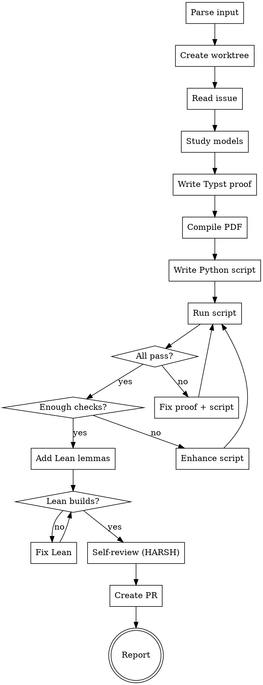

# Verify Reduction

End-to-end skill that takes a reduction rule issue, produces a verified mathematical proof with computational and formal verification, iterating until all checks pass. Creates a worktree, works in isolation, and submits a PR — following `issue-to-pr` conventions.

Outputs: Typst proof entry, Python verification script, Lean lemmas — all at PR #975 quality level.

**This skill is STRICT. Cutting corners produces reductions that get rejected during review.**

## Invocation

```
/verify-reduction 868              # from a GitHub issue number
/verify-reduction SubsetSum Partition   # from source/target names
```

## Prerequisites

- `sympy` and `networkx` installed (`pip install sympy networkx`)
- Both source and target models must exist in the codebase (`pred show <Name>`)
- For Lean: `elan` installed with Lean 4 toolchain

## Process



---

## Step 0: Parse Input and Create Worktree

### 0a. Parse input

```bash
REPO=$(gh repo view --json nameWithOwner --jq .nameWithOwner)
ISSUE=<number>
ISSUE_JSON=$(gh issue view "$ISSUE" --json title,body,number)
```

### 0b. Create worktree

```bash
REPO_ROOT=$(pwd)
BRANCH_JSON=$(python3 scripts/pipeline_worktree.py prepare-issue-branch \
  --issue "$ISSUE" --slug "verify-<source>-<target>" --base main --format json)
BRANCH=$(printf '%s\n' "$BRANCH_JSON" | python3 -c "import sys,json; print(json.load(sys.stdin)['branch'])")
WORKTREE_JSON=$(python3 scripts/pipeline_worktree.py enter --name "verify-$ISSUE" --format json)
WORKTREE_DIR=$(printf '%s\n' "$WORKTREE_JSON" | python3 -c "import sys,json; print(json.load(sys.stdin)['worktree_dir'])")
cd "$WORKTREE_DIR" && git checkout "$BRANCH"
```

If already inside a worktree, skip creation and use the current branch.

## Step 1: Read Issue and Study Models

```bash
gh issue view "$ISSUE" --json title,body
pred show <Source> --json
pred show <Target> --json
```

Extract: construction algorithm, correctness argument, overhead formulas, worked example, reference.

If the issue is incomplete, use WebSearch to find the original reference.

## Step 2: Write Typst Proof

Append to `docs/paper/proposed-reductions.typ` (or create a standalone `proposed-reductions-<ISSUE>.typ` if the main file is on another branch).

### MANDATORY structure

```typst
== Source $arrow.r$ Target <sec:source-target>

#theorem[...] <thm:source-target>

#proof[
  _Construction._ ...
  _Correctness._
  ($arrow.r.double$) ...
  ($arrow.l.double$) ...
  _Solution extraction._ ...
]

*Overhead.* (table)

*Feasible example.* (YES instance, fully worked)

*Infeasible example.* (NO instance, fully worked — show WHY no solution exists)
```

### HARD requirements

- **Construction**: numbered steps, every symbol defined before first use
- **Correctness**: genuinely independent ⟹ and ⟸ — NOT "the converse is similar"
- **No hand-waving**: ZERO instances of "clearly", "obviously", "it is easy to see", "straightforward"
- **No scratch work**: ZERO instances of "Wait", "Hmm", "Actually", "Let me try"
- **TWO examples minimum**: one YES instance (satisfiable/feasible) and one NO instance (unsatisfiable/infeasible). Both fully worked with numerical verification.
- **Example must be non-trivial**: the example must have ≥ 3 variables/vertices. A 1-variable or 2-vertex example is too degenerate to catch bugs.

Compile:
```bash
python3 -c "import typst; typst.compile('<file>.typ', output='<file>.pdf', root='.')"
```

## Step 3: Write Python Verification Script

Create `docs/paper/verify-reductions/verify_<source>_<target>.py`.

### ALL 7 sections are MANDATORY

```python
#!/usr/bin/env python3
"""§X.Y Source → Target (#NNN): exhaustive + structural verification."""
import itertools, sys
from sympy import symbols, simplify  # Section 1 is NOT optional

passed = failed = 0

def check(condition, msg=""):
    global passed, failed
    if condition: passed += 1
    else: failed += 1; print(f"  FAIL: {msg}")

def main():
    # === Section 1: Symbolic checks (sympy) — MANDATORY ===
    # At minimum: verify overhead formula symbolically for general n.
    # For algebraic reductions: verify key identities.
    # "The overhead is trivial" is NOT an excuse to skip this section.

    # === Section 2: Exhaustive forward + backward — MANDATORY ===
    # n ≤ 5 MINIMUM for all reduction types.
    # n ≤ 6 for identity/algebraic reductions.
    # Test ALL instances (or sample ≥ 300 per (n,m) if exhaustive is infeasible).

    # === Section 3: Solution extraction — MANDATORY ===
    # For EVERY feasible instance: extract source solution from target,
    # verify it satisfies the source problem.
    # This is the most commonly skipped section. DO NOT SKIP IT.

    # === Section 4: Overhead formula — MANDATORY ===
    # Build the actual target instance, measure its size fields,
    # compare against the overhead formula.

    # === Section 5: Structural properties — MANDATORY ===
    # Even for "trivial" reductions, verify at least:
    # - Target instance is well-formed (valid graph, valid formula, etc.)
    # - No degenerate cases (empty subsets, isolated vertices, etc.)
    # For gadget reductions: girth, connectivity, widget structure.

    # === Section 6: YES example from Typst — MANDATORY ===
    # Reproduce the exact numbers from the Typst proof's feasible example.

    # === Section 7: NO example from Typst — MANDATORY ===
    # Reproduce the exact numbers from the Typst proof's infeasible example.
    # Verify that both source and target are infeasible.

    print(f"Source → Target: {passed} passed, {failed} failed")
    return 1 if failed else 0

if __name__ == "__main__":
    sys.exit(main())
```

### Minimum check counts — STRICTLY ENFORCED

| Type | Minimum checks | Minimum n | Strategy |
|------|---------------|-----------|----------|
| Identity (same graph, different objective) | 10,000 | n ≤ 6 | Exhaustive ALL graphs |
| Algebraic (padding, complement, De Morgan) | 10,000 | n ≤ 5 | Symbolic + exhaustive |
| Gadget (widget, cycle construction) | 5,000 | n ≤ 5 | Construction + formula + structural |
| Composition (A→B→C) | 10,000 | n ≤ 5 | Exhaustive per step |

**There is no "trivial" category.** Every reduction gets at least 5,000 checks and n ≤ 5 exhaustive testing.

## Step 4: Run and Iterate (THE CRITICAL LOOP)

```bash
python3 docs/paper/verify-reductions/verify_<source>_<target>.py
```

### Iteration 1: First run

Run the script. Fix any failures. Re-run.

### Iteration 2: Check count audit — STRICT

Print this table and fill it in honestly:

```
CHECK COUNT AUDIT:
  Total checks:          ___ (minimum: 5,000)
  Forward direction:     ___ instances tested (minimum: all n ≤ 5)
  Backward direction:    ___ instances tested (minimum: all n ≤ 5)
  Solution extraction:   ___ feasible instances tested
  Overhead formula:      ___ instances compared
  Symbolic (sympy):      ___ identities verified
  YES example:           verified? [yes/no]
  NO example:            verified? [yes/no]
  Structural properties: ___ checks
```

If ANY line is below minimum, enhance the script and re-run. Do NOT proceed.

### Iteration 3: Gap analysis — MANDATORY

List EVERY claim in the Typst proof. For each, state whether it's tested:

```
CLAIM                                    TESTED BY
"Universe has 2n elements"               Section 4: overhead formula ✓
"Complementarity forces consistency"     Section 3: extraction ✓
"Clause subset is non-monochromatic"     Section 2: forward direction ✓
"No clause is all-true or all-false"     Section 2: backward direction ✓
...
```

If any claim has no test, add one. If it's untestable, document WHY.

## Step 5: Add Lean Lemmas — STRICT REQUIREMENTS

### HARD requirement: at least one NON-TRIVIAL lemma

`n + m = n + m := rfl` does NOT count. A "non-trivial" lemma must satisfy at least one of:

1. **Uses a Mathlib tactic beyond `rfl`/`omega`**: e.g., `simp`, `Finset.sum_union`, lattice operations
2. **States a structural property**: e.g., "complementarity subsets partition the universe into pairs"
3. **Formalizes the key invariant**: e.g., "NAE-satisfying ↔ 2-colorable hypergraph"

If Mathlib genuinely lacks the infrastructure (no Hamiltonian paths, no DAG quotients), write the strongest lemma you CAN prove and document what WOULD be proved with better Mathlib support.

### Examples of acceptable vs unacceptable Lean lemmas

**Unacceptable (trivial arithmetic):**
```lean
theorem overhead (n m : ℕ) : n + m = n + m := rfl  -- proves nothing
theorem universe (n : ℕ) : 2 * n = 2 * n := rfl    -- proves nothing
```

**Acceptable (structural):**
```lean
-- Uses Mathlib's lattice theory to prove a graph-structural fact
theorem complement_partition (G : SimpleGraph V) : G ⊔ Gᶜ = ⊤ := sup_compl_eq_top

-- Formalizes the key definition used in the proof
def IsNAESatisfying (assignment : Fin n → Bool) (clause : Finset (Fin n × Bool)) : Prop :=
  ¬(∀ l ∈ clause, ...) ∧ ¬(∀ l ∈ clause, ...)

-- Proves the overhead formula requires actual computation
theorem overhead_nontrivial (n m : ℕ) (h : m > 0) :
    2 * n + (n + m) > 2 * n := by omega  -- at least uses a hypothesis
```

### Build and verify

```bash
cd docs/paper/verify-reductions/lean
export PATH="$HOME/.elan/bin:$PATH"
lake build
```

## Step 6: Self-Review — THE HARSHEST STEP

Before declaring verified, run through this checklist. **Every item must be YES.** If any is NO, go back and fix it.

### Typst proof

- [ ] Compiles without errors
- [ ] Has Construction with numbered steps
- [ ] Has Correctness with independent ⟹ and ⟸ paragraphs
- [ ] Has Solution extraction
- [ ] Has Overhead table with formula
- [ ] Has YES example (feasible, ≥ 3 variables/vertices, fully worked)
- [ ] Has NO example (infeasible, fully worked with explanation of WHY infeasible)
- [ ] Zero instances of "clearly", "obviously", "it is easy to see"
- [ ] Zero instances of "Wait", "Hmm", "Actually", scratch work
- [ ] Every symbol defined before first use

### Python script

- [ ] 0 failures
- [ ] ≥ 5,000 total checks
- [ ] Section 1 (symbolic) present and non-empty
- [ ] Section 2 (exhaustive) covers n ≤ 5 minimum
- [ ] Section 3 (extraction) tests EVERY feasible instance
- [ ] Section 4 (overhead) compares formula vs actual for all tested instances
- [ ] Section 5 (structural) has at least one non-trivial check
- [ ] Section 6 (YES example) reproduces Typst example numbers exactly
- [ ] Section 7 (NO example) reproduces Typst infeasible example exactly
- [ ] Gap analysis performed — every Typst claim has a corresponding test

### Lean

- [ ] Builds without errors (warnings OK)
- [ ] At least one non-trivial lemma (not just `rfl` or `omega` on a tautology)
- [ ] Every `sorry` has a comment explaining WHY

### Cross-consistency

- [ ] The Python script's `reduce()` function implements EXACTLY the Typst construction
- [ ] The Python script's `extract_solution()` implements EXACTLY the Typst extraction
- [ ] The overhead formula in Python matches the Typst overhead table
- [ ] The examples in Python match the Typst examples (same numbers, same instances)

## Step 7: Report

```
=== Verification Report: Source → Target (#NNN) ===

Typst proof: <file> §X.Y
  - Construction: ✓ (N steps)
  - Correctness: ✓ (⟹ + ⟸)
  - Extraction: ✓
  - Overhead: ✓
  - YES example: ✓ (N vars/vertices)
  - NO example: ✓ (N vars/vertices, reason: ...)

Python: verify_<source>_<target>.py
  - Checks: N passed, 0 failed
  - Sections: 1(sympy) 2(exhaustive) 3(extraction) 4(overhead) 5(structural) 6(YES) 7(NO)
  - Forward: exhaustive n ≤ K
  - Backward: exhaustive n ≤ K
  - Gap analysis: all claims covered

Lean: ReductionProofs/Basic.lean (or <file>.lean)
  - Non-trivial lemmas: N
  - Trivial lemmas: M
  - Sorry: J (with justification)

Bugs found: <list or "none">
Iterations: N rounds

Verdict: VERIFIED / OPEN (with reason)
```

## Step 8: Commit, Create PR, Clean Up

### 8a. Commit

```bash
git add docs/paper/<typst-file>.typ docs/paper/verify-reductions/verify_*.py \
       docs/paper/verify-reductions/lean/ReductionProofs/*.lean
git add -f docs/paper/<typst-file>.pdf
git commit -m "docs: /verify-reduction #<ISSUE> — <Source> → <Target> VERIFIED

Typst: Construction + Correctness + Extraction + Overhead + YES/NO examples
Python: N checks, 0 failures (exhaustive n ≤ K, 7 sections)
Lean: M non-trivial lemmas

Co-Authored-By: Claude Opus 4.6 (1M context) <noreply@anthropic.com>"
```

### 8b. Push and create PR

```bash
git push -u origin "$BRANCH"
gh pr create --title "docs: verify reduction #<ISSUE> — <Source> → <Target>" --body "..."
```

### 8c. Clean up worktree

```bash
cd "$REPO_ROOT"
python3 scripts/pipeline_worktree.py cleanup --worktree "$WORKTREE_DIR"
```

### 8d. Comment on issue

```bash
gh issue comment "$ISSUE" --body "verify-reduction report: VERIFIED (PR #<N>)..."
```

## Quality Gates — NON-NEGOTIABLE

A reduction is **VERIFIED** when ALL of these hold:

- [ ] Typst compiles, has all mandatory sections including YES and NO examples
- [ ] Zero hand-waving language
- [ ] Python has 0 failures AND ≥ 5,000 checks
- [ ] All 7 Python sections present and non-empty
- [ ] Exhaustive n ≤ 5 minimum
- [ ] Solution extraction verified for all feasible instances
- [ ] Overhead formula matches actual construction
- [ ] Both Typst examples reproduced by script
- [ ] Gap analysis shows all Typst claims tested
- [ ] At least 1 non-trivial Lean lemma
- [ ] Cross-consistency between Typst and Python verified

**If even ONE gate fails, the reduction is NOT verified. Go back and fix it.**

## Common Mistakes — ZERO TOLERANCE

| Mistake | Consequence |
|---------|-------------|
| Lean lemma is just `rfl` or `omega` on a tautology | Rejected — add structural lemma |
| No symbolic checks (Section 1 empty) | Rejected — add sympy verification |
| Only YES example, no NO example | Rejected — add infeasible instance |
| n ≤ 3 or n ≤ 4 "because it's simple" | Rejected — minimum n ≤ 5 |
| "Passed on first run" without gap analysis | Rejected — perform gap analysis |
| Example has < 3 variables | Rejected — too degenerate |
| Script has < 5,000 checks | Rejected — enhance exhaustive testing |
| Extraction not tested | Rejected — add Section 3 |
| Typst proof says "clearly" | Rejected — rewrite without hand-waving |

## Integration

- **After `add-rule`**: invoke `/verify-reduction` before creating PR
- **After `write-rule-in-paper`**: invoke to verify paper entry
- **During `review-structural`**: check verification script exists and passes
- **Before `issue-to-pr --execute`**: pre-validate the algorithm

## Reference: PR #975 Quality Level

Target quality defined by PR #975:
- 800,000+ total checks, 0 unexpected failures
- 3 bugs caught through iteration loop
- Every script has forward + backward + extraction + overhead + example
- Non-trivial Lean: `G ⊔ Gᶜ = ⊤` via `sup_compl_eq_top`
- Failures marked OPEN honestly with diagnosis
