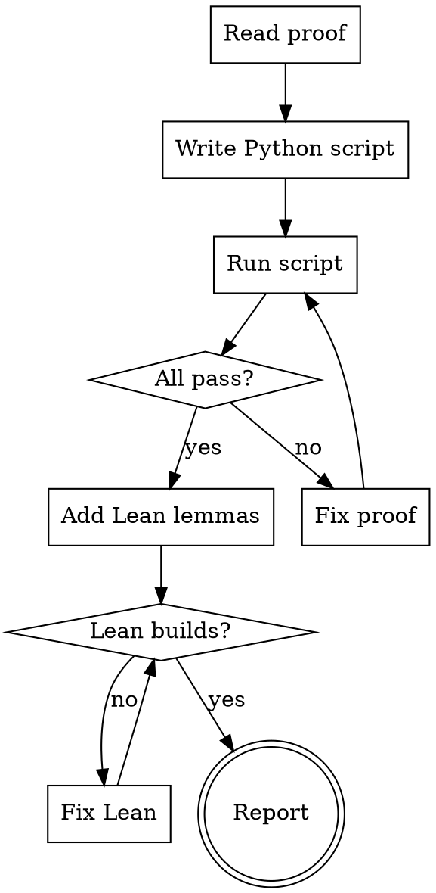

# Verify Reduction

Verify a reduction rule's mathematical proof using computational (Python) and formal (Lean) methods. This skill is invoked after writing or modifying a reduction rule to ensure correctness before implementation.

## Invocation

```
/verify-reduction <Source> <Target>
/verify-reduction           # verify all reductions in proposed-reductions.typ
```

## Prerequisites

- `sympy` and `networkx` installed (`pip install sympy networkx`)
- The reduction's Typst proof must exist in `docs/paper/proposed-reductions.typ` or `docs/paper/reductions.typ`
- For Lean: `elan` installed with Lean 4 toolchain

## Process



## Step 1: Read the Proof

Read the reduction's theorem, proof (Construction / Correctness / Extraction), overhead table, and worked example from the Typst source.

Extract:
- **Source and target problem definitions** (`pred show <Source> --json`, `pred show <Target> --json`)
- **Construction algorithm** (numbered steps)
- **Overhead formulas** (target size fields as expressions of source size fields)
- **Worked example** (concrete instance with expected answer)

## Step 2: Write Python Verification Script

Create `docs/paper/verify-reductions/verify_<source>_<target>.py` following this template:

```python
#!/usr/bin/env python3
"""§X.Y Source → Target: exhaustive + structural verification."""
import itertools, sys

passed = failed = 0

def check(condition, msg=""):
    global passed, failed
    if condition: passed += 1
    else: failed += 1; print(f"  FAIL: {msg}")

def main():
    # === Section 1: Symbolic checks (sympy) ===
    # Verify key algebraic identities for general n

    # === Section 2: Exhaustive forward/backward ===
    # For ALL instances up to n=6 (or n=5 for expensive checks):
    #   source_feasible = check_source(instance)
    #   target = reduce(instance)
    #   target_feasible = check_target(target)
    #   check(source_feasible == target_feasible)

    # === Section 3: Solution extraction ===
    # For feasible instances: extract source solution from target,
    # verify it actually solves the source problem

    # === Section 4: Overhead formula ===
    # Compare formula vs actual constructed sizes

    # === Section 5: Structural properties ===
    # Girth, connectivity, widget edge count, cycle analysis, etc.

    # === Section 6: Paper example ===
    # Verify the specific worked example from the Typst note

    print(f"Source → Target: {passed} passed, {failed} failed")
    return 1 if failed else 0

if __name__ == "__main__":
    sys.exit(main())
```

### Mandatory sections

Every script MUST include:

| Section | What to test | Minimum checks |
|---------|-------------|---------------|
| Forward direction | Source has solution → target has solution | Exhaustive n≤5 |
| Backward direction | Target has solution → extracted source solution valid | Exhaustive n≤5 |
| Overhead formula | Formula output matches actual construction size | All graphs n≤6 |
| Solution extraction | Extracted solution satisfies source problem | All feasible instances n≤5 |
| Paper example | Numbers in Typst example match computation | 1 (exact) |

### Strategy by reduction type

**Identity reductions** (same graph, different objective):
- Exhaustive ALL graphs n≤6, all parameter values
- Target: 10,000+ checks

**Algebraic reductions** (padding, complement):
- Symbolic (sympy) for general identities
- Exhaustive all instances n≤6
- Target: 20,000+ checks

**Gadget-based reductions** (widget construction):
- Build gadget graph, verify vertex/edge counts
- Structural properties (girth, widget internal edges, chain links)
- Forward/backward on small instances where affordable
- Formula on all graphs n≤6
- Target: 5,000+ checks

**Composition reductions** (A→B→C):
- Test each step independently
- Exhaustive for the transformation step (ALL graphs n≤5)
- Target: 10,000+ checks

## Step 3: Run and Iterate

```bash
python3 docs/paper/verify-reductions/verify_<source>_<target>.py
```

**If failures found:**
1. Diagnose: is the bug in the construction, the proof, or the script?
2. If construction bug: fix the Typst proof, recompile PDF
3. If script bug: fix the script
4. Re-run until 0 failures
5. If the construction is fundamentally broken: mark the Typst entry as OPEN in red

**Do NOT declare a reduction verified until the script passes with 0 failures.**

## Step 4: Add Lean Lemmas

Add to `docs/paper/verify-reductions/lean/ReductionProofs/Basic.lean`:

### Required lemmas (for every reduction)

- **Overhead arithmetic**: verify the overhead formula simplifies correctly (`omega`)
- **Key identity**: the central algebraic identity the proof relies on

### Recommended lemmas (when Mathlib supports them)

- **Structural invariants**: graph decomposition, edge-set partition (`Finset.sum_union`)
- **Problem type definitions**: inductive types for gadget vertices (`DecidableEq`, `Fintype`)

### Build and verify

```bash
cd docs/paper/verify-reductions/lean
export PATH="$HOME/.elan/bin:$PATH"
lake build
```

**`sorry` is acceptable** for lemmas requiring infrastructure that Mathlib doesn't have (Hamiltonian path enumeration, DAG quotients). Document WHY in a comment.

## Step 5: Report

Output a summary table:

```
=== Verification Report: Source → Target ===
Python: <N> checks, <M> failed
Lean:   <K> lemmas proved, <J> sorry
Bugs found: <list or "none">
Verdict: VERIFIED / OPEN (with reason)
```

## Quality Gates

A reduction is **VERIFIED** when:
- [ ] Python script has 0 failures
- [ ] Python script has ≥ 1,000 checks (≥ 10,000 for algebraic/identity reductions)
- [ ] Forward AND backward directions tested exhaustively for n ≤ 5
- [ ] Solution extraction verified for all feasible instances
- [ ] Overhead formula matches actual construction for all tested instances
- [ ] At least 1 Lean lemma proved (overhead arithmetic at minimum)
- [ ] Paper example numerically verified

A reduction is **OPEN** when:
- Python script finds failures that indicate a fundamental construction flaw
- The flaw cannot be fixed without redesigning the construction
- The entry in the Typst note is marked in red with failure diagnosis

## Common Mistakes

| Mistake | Fix |
|---------|-----|
| Testing only forward direction | MUST test backward: target solution → valid source solution |
| Testing only formula, not construction | Build the actual gadget graph and check structural properties |
| Lean proof is just arithmetic | Add at least one structural lemma using Mathlib |
| Script passes on small n but proof has gap | This is acceptable — document what's tested vs what's proved |
| Declaring "verified" with <100 checks | Minimum 1,000 checks; exhaustive for n ≤ 5 |
| Hiding failures | Mark OPEN honestly with failure diagnosis |
| Not testing solution extraction | Extract source solution and verify it satisfies the source problem |

## Integration

- **After `add-rule`**: invoke `verify-reduction` on the new rule before PR
- **After `write-rule-in-paper`**: invoke to verify the paper entry matches the code
- **During `review-structural`**: check that verification script exists and passes
