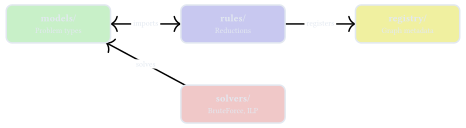
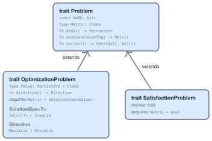
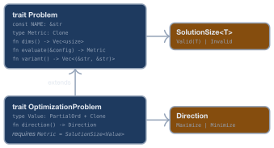
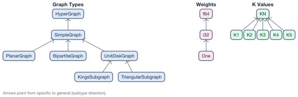
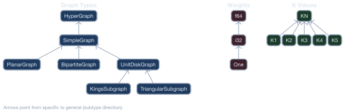
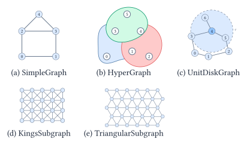
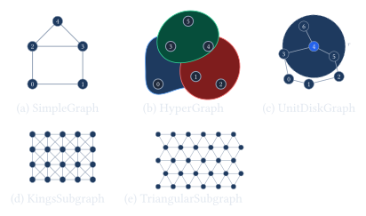

# Design

This guide covers the library internals for contributors.

## Module Overview

<div class="theme-light-only">


</div>
<div class="theme-dark-only">



</div>

| Module | Purpose |
|--------|---------|
| [`src/models/`](#problem-model) | Problem type implementations (SAT, Graph, Set, Optimization) |
| [`src/rules/`](#reduction-rules) | Reduction rules with `ReduceTo` implementations |
| [`src/registry/`](#reduction-graph) | Compile-time reduction graph metadata |
| [`src/solvers/`](#solvers) | BruteForce and ILP solvers |
| `src/traits.rs` | Core `Problem` and `OptimizationProblem` traits (see [Problem Model](#problem-model)) |
| `src/types.rs` | Shared types: `SolutionSize`, `Direction`, `ProblemSize` (see [Problem Model](#problem-model)) |
| `src/variant.rs` | Variant parameter system (see [Variant System](#variant-system)) |

## Problem Model

Every problem implements `Problem`. Optimization problems additionally implement `OptimizationProblem`; satisfaction problems implement `SatisfactionProblem`.

- **`Problem`** — the base trait. Every problem declares a `NAME` (e.g., `"MaximumIndependentSet"`). The solver explores the configuration space defined by `dims()` and scores each configuration with `evaluate()`. For example, a 4-vertex MIS has `dims() = [2, 2, 2, 2]` (each vertex is selected or not); `evaluate(&[1, 0, 1, 0])` returns `Valid(2)` if vertices 0 and 2 form an independent set, or `Invalid` if they share an edge.
- **`OptimizationProblem`** — extends `Problem` with a comparable `Value` type and a `direction()` (`Maximize` or `Minimize`).
- **`SatisfactionProblem`** — constrains `Metric = bool`: `true` if all constraints are satisfied, `false` otherwise.

<div class="theme-light-only">



</div>
<div class="theme-dark-only">



</div>

## Variant System

A single problem name like `MaximumIndependentSet` can have multiple **variants** — carrying weights on vertices, or defined on a restricted topology (e.g., king's subgraph). Some variants are more specific than others: the king's subgraph is a special case of the unit-disk graph, which is a special case of the simple graph.

In **set** language, variants form **subsets**: independent sets on king's subgraphs are a subset of independent sets on unit-disk graphs. The reduction from a more specific variant to a less specific one is a **variant cast** — an identity mapping where vertex/element indices are preserved. Each such cast is explicitly declared as a `#[reduction]` registration using the `impl_variant_reduction!` macro.

<div class="theme-light-only">



</div>
<div class="theme-dark-only">



</div>

Arrows indicate the **subset** (subtype) direction. Variant types fall into three categories:

- **Graph type** — `HyperGraph` (root), `SimpleGraph`, `PlanarGraph`, `BipartiteGraph`, `UnitDiskGraph`, `KingsSubgraph`, `TriangularSubgraph`.
- **Weight type** — `One` (unweighted), `i32`, `f64`.
- **K value** — e.g., `K3` for 3-SAT, `KN` for arbitrary K.

<div class="theme-light-only">



</div>
<div class="theme-dark-only">



</div>

### VariantParam trait

Each variant parameter type implements `VariantParam`, which declares its category, value, and optional parent:

```rust
pub trait VariantParam: 'static {
    const CATEGORY: &'static str;     // e.g., "graph", "weight", "k"
    const VALUE: &'static str;        // e.g., "SimpleGraph", "i32"
    const PARENT_VALUE: Option<&'static str>;  // None for root types
}
```

Types with a parent also implement `CastToParent`, providing the runtime conversion for variant casts:

```rust
pub trait CastToParent: VariantParam {
    type Parent: VariantParam;
    fn cast_to_parent(&self) -> Self::Parent;
}
```

### Registration with `impl_variant_param!`

The `impl_variant_param!` macro implements `VariantParam` (and optionally `CastToParent` / `KValue`) for a type:

```rust
// Root type (no parent):
impl_variant_param!(HyperGraph, "graph");

// Type with parent (cast closure required):
impl_variant_param!(SimpleGraph, "graph", parent: HyperGraph,
    cast: |g| {
        let edges: Vec<Vec<usize>> = g.edges().into_iter().map(|(u, v)| vec![u, v]).collect();
        HyperGraph::new(g.num_vertices(), edges)
    });

// K root (arbitrary K):
impl_variant_param!(KN, "k", k: None);

// Specific K with parent:
impl_variant_param!(K3, "k", parent: KN, cast: |_| KN, k: Some(3));
```

### Variant cast reductions with `impl_variant_reduction!`

When a more specific variant (e.g., `KingsSubgraph`) needs to be treated as a less specific one (e.g., `UnitDiskGraph`), an explicit variant cast reduction is declared using `impl_variant_reduction!`. This generates a `ReduceTo` impl with `#[reduction]` registration and identity overhead:

```rust
impl_variant_reduction!(
    MaximumIndependentSet,
    <KingsSubgraph, i32> => <UnitDiskGraph, i32>,
    fields: [num_vertices, num_edges],
    |src| MaximumIndependentSet::from_graph(
        src.graph().cast_to_parent(), src.weights())
);
```

The problem name appears once, followed by `<SourceParams> => <TargetParams>`. This works with any number of type parameters. All variant casts use `ReductionAutoCast` for identity solution mapping (vertex/element indices are preserved) and `ReductionOverhead::identity()` for the overhead fields.

### Composing `Problem::variant()`

The `variant_params!` macro composes the `Problem::variant()` body from type parameter names:

```rust
// MaximumIndependentSet<G: VariantParam, W: VariantParam>
fn variant() -> Vec<(&'static str, &'static str)> {
    crate::variant_params![G, W]
    // e.g., MaximumIndependentSet<UnitDiskGraph, One>
    //     -> vec![("graph", "UnitDiskGraph"), ("weight", "One")]
}
```

## Reduction Rules

A reduction requires two pieces: a **result struct** and a **`ReduceTo<T>` impl**.

### Result struct

Holds the target problem and the logic to map solutions back:

```rust
#[derive(Debug, Clone)]
pub struct ReductionISToVC<W> {
    target: MinimumVertexCover<SimpleGraph, W>,
}

impl<W: WeightElement + VariantParam> ReductionResult for ReductionISToVC<W> {
    type Source = MaximumIndependentSet<SimpleGraph, W>;
    type Target = MinimumVertexCover<SimpleGraph, W>;

    fn target_problem(&self) -> &Self::Target { &self.target }
    fn extract_solution(&self, target_sol: &[usize]) -> Vec<usize> {
        target_sol.iter().map(|&x| 1 - x).collect()  // complement
    }
}
```

### `ReduceTo<T>` impl with the `#[reduction]` macro

```rust
#[reduction(
    overhead = {
        ReductionOverhead::new(vec![
            ("num_vertices", poly!(num_vertices)),
            ("num_edges", poly!(num_edges)),
        ])
    }
)]
impl ReduceTo<MinimumVertexCover<SimpleGraph, i32>>
    for MaximumIndependentSet<SimpleGraph, i32>
{
    type Result = ReductionISToVC<i32>;
    fn reduce_to(&self) -> Self::Result { /* ... */ }
}
```

### What the macro generates

The `#[reduction]` attribute expands to the original `impl` block plus an `inventory::submit!` call:

```rust
inventory::submit! {
    ReductionEntry {
        source_name: "MaximumIndependentSet",
        target_name: "MinimumVertexCover",
        source_variant_fn: || <MaximumIndependentSet<SimpleGraph, i32> as Problem>::variant(),
        target_variant_fn: || <MinimumVertexCover<SimpleGraph, i32> as Problem>::variant(),
        overhead_fn: || ReductionOverhead::new(vec![
            ("num_vertices", poly!(num_vertices)),
            ("num_edges", poly!(num_edges)),
        ]),
        module_path: module_path!(),
    }
}
```

This `ReductionEntry` is collected at compile time by `inventory`, making the reduction discoverable by the `ReductionGraph` without any manual registration.

## Reduction Graph

The `ReductionGraph` is the central runtime data structure. It collects all registered reductions to enable path finding and overhead evaluation.

### Construction

`ReductionGraph::new()` scans `inventory::iter::<ReductionEntry>` and builds a variant-level `petgraph::DiGraph`:

- **Nodes** are unique `(problem_name, variant)` pairs — e.g., `("MaximumIndependentSet", {graph: "KingsSubgraph", weight: "i32"})`. Different variants of the same problem are separate nodes.
- **Edges** come exclusively from `#[reduction]` registrations. This includes both cross-problem reductions (e.g., MIS → QUBO) and variant casts (e.g., MIS on KingsSubgraph → MIS on UnitDiskGraph).

There are no auto-generated edges. Every edge in the graph corresponds to an explicit `ReduceTo` impl in the source code.

### JSON export

`ReductionGraph::to_json()` produces a `ReductionGraphJson` with all variant nodes and reduction edges:

- [reduction_graph.json](reductions/reduction_graph.json) — all problem variants and reduction edges
- [problem_schemas.json](reductions/problem_schemas.json) — field definitions for each problem type

## Path Finding

Path finding operates on the variant-level graph. Since each node is a `(name, variant)` pair, the graph directly encodes which variant transitions are possible.

### Name-level paths

`find_paths_by_name(src, dst)` enumerates all simple paths between any variant of the source and any variant of the target, deduplicating consecutive same-name nodes to produce name-level paths. `find_shortest_path_by_name()` returns the one with fewest hops.

### Dijkstra with cost functions

For cost-aware routing, `find_cheapest_path()` uses **Dijkstra's algorithm** over the variant-level graph:

```rust
pub fn find_cheapest_path<C: PathCostFn>(
    &self,
    source: (&str, &str),        // (problem_name, graph_type)
    target: (&str, &str),
    input_size: &ProblemSize,
    cost_fn: &C,
) -> Option<ReductionPath>
```

Since variant casts are explicit edges with identity overhead, Dijkstra naturally traverses them when they appear on the cheapest path.

### Cost functions

The `PathCostFn` trait computes edge cost from overhead and current problem size:

```rust
pub trait PathCostFn {
    fn edge_cost(&self, overhead: &ReductionOverhead, current_size: &ProblemSize) -> f64;
}
```

Built-in implementations:

| Cost function | Strategy |
|--------------|----------|
| `Minimize("field")` | Minimize a single output field |
| `MinimizeWeighted([(field, w)])` | Weighted sum of output fields |
| `MinimizeMax([fields])` | Minimize the maximum of fields |
| `MinimizeLexicographic([fields])` | Lexicographic: minimize first, break ties with rest |
| `MinimizeSteps` | Minimize number of hops (unit edge cost) |
| `CustomCost(closure)` | User-defined cost function |

### Example: MIS on KingsSubgraph to MinimumVertexCover

Finding a path from `MIS{KingsSubgraph, i32}` to `VC{SimpleGraph, i32}`:

```
MIS{KingsSubgraph,i32} -> MIS{UnitDiskGraph,i32} -> MIS{SimpleGraph,i32} -> VC{SimpleGraph,i32}
     variant cast              variant cast                reduction
```

Each variant cast is an explicit edge registered via `impl_variant_reduction!`, so the path finder treats all edges uniformly.

## Overhead Evaluation

Each reduction declares how the output problem size relates to the input size, expressed as polynomials.

### ProblemSize

A `ProblemSize` holds named size components — the dimensions that characterize a problem instance:

```rust
let size = ProblemSize::new(vec![("num_vertices", 10), ("num_edges", 15)]);
assert_eq!(size.get("num_vertices"), Some(10));
```

### Polynomials

Output size formulas use `Polynomial` (a sum of `Monomial` terms). The `poly!` macro provides a concise syntax:

```rust
poly!(num_vertices)              // p(x) = num_vertices
poly!(num_vertices ^ 2)          // p(x) = num_vertices^2
poly!(3 * num_edges)             // p(x) = 3 * num_edges
poly!(num_vertices * num_edges)  // p(x) = num_vertices * num_edges
```

A `ReductionOverhead` pairs output field names with their polynomials:

```rust
ReductionOverhead::new(vec![
    ("num_vars", poly!(num_vertices) + poly!(num_edges)),
    ("num_clauses", poly!(3 * num_edges)),
])
```

### Evaluating overhead

`ReductionOverhead::evaluate_output_size(input)` substitutes input values into the polynomials and returns a new `ProblemSize`:

```
Input:  ProblemSize { num_vertices: 10, num_edges: 15 }
Output: ProblemSize { num_vars: 25, num_clauses: 45 }
```

### Composing through a path

For a multi-step reduction path, overhead composes: the output of step $N$ becomes the input of step $N+1$. Each edge carries its own `ReductionOverhead`, so the total output size is computed by chaining `evaluate_output_size` calls through the path. Variant cast edges use `ReductionOverhead::identity()`, passing through all fields unchanged.

## Reduction Execution

A `ResolvedPath` is a **plan**, not an executor. It provides variant and overhead information at each step, but callers dispatch the actual transformations themselves.

### Dispatching steps

Walk the `edges` array and call `ReduceTo::reduce_to()` on the current problem at each step to produce a `ReductionResult`, then call `target_problem()` to get the next problem. Both cross-problem reductions and variant casts are dispatched uniformly through `ReduceTo`.

### Extracting solutions

After solving the final target problem, walk the chain **in reverse**, calling `extract_solution(&target_solution)` on each `ReductionResult` to map the solution back to the source space. Variant cast reductions use `ReductionAutoCast`, which passes indices through unchanged (identity mapping).

### Why concrete types (no type erasure)

The library uses concrete types at each step rather than `dyn Problem`. This preserves full type safety and avoids boxing overhead, at the cost of requiring callers to know the types at each step. This design choice keeps the reduction pipeline zero-cost and makes the compiler verify correctness at each transformation boundary.

## Solvers

Solvers implement the `Solver` trait:

```rust
pub trait Solver {
    fn find_best<P: OptimizationProblem>(&self, problem: &P) -> Option<Vec<usize>>;
    fn find_satisfying<P: Problem<Metric = bool>>(&self, problem: &P) -> Option<Vec<usize>>;
}
```

### BruteForce

Enumerates every configuration in the space defined by `dims()`. Suitable for small instances (<20 variables). In addition to the `Solver` trait methods, provides:

- `find_all_best(problem)` — returns all tied-optimal configurations.
- `find_all_satisfying(problem)` — returns all satisfying configurations.

Primarily used for **testing and verification** of reductions via closed-loop tests.

### ILPSolver

Feature-gated behind `ilp`. Uses the HiGHS solver via the `good_lp` crate. Additionally provides `solve_reduced()` for problems that implement `ReduceTo<ILP>` — it reduces, solves the ILP, and extracts the solution in one call.

## JSON Serialization

All problem types support JSON serialization via serde:

```rust
use problemreductions::io::{to_json, from_json};

let json = to_json(&problem)?;
let restored: MaximumIndependentSet<SimpleGraph, i32> = from_json(&json)?;
```

**Exported JSON files:**
- [reduction_graph.json](reductions/reduction_graph.json) — all problem variants and reduction edges
- [problem_schemas.json](reductions/problem_schemas.json) — field definitions for each problem type

Regenerate exports:

```bash
cargo run --example export_graph                # docs/src/reductions/reduction_graph.json (default)
cargo run --example export_graph -- output.json # custom output path
cargo run --example export_schemas              # docs/src/reductions/problem_schemas.json
```

## Contributing

See [Call for Contributions](./introduction.md#call-for-contributions) for the recommended issue-based workflow (no coding required).
