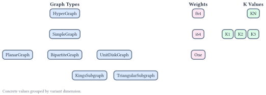
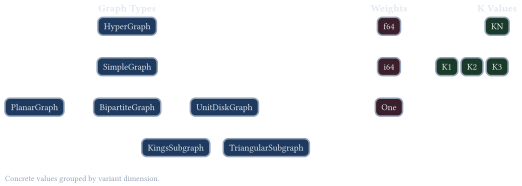
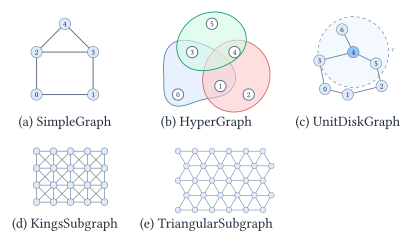
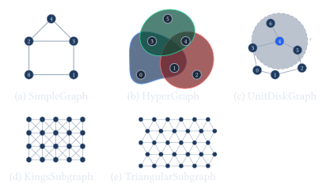

# Design

This guide covers the library internals for contributors.

See [Numeric types and arithmetic](#numeric-types-and-arithmetic) before
choosing numeric fields or implementing arithmetic in a model or reduction.

## Module Architecture

<script src="https://unpkg.com/cytoscape@3.30.4/dist/cytoscape.min.js"></script>

<div id="module-graph"></div>
<div id="mg-controls">
  <div id="mg-legend">
    <span class="swatch" style="background:#c8f0c8;"></span>Core
    <span class="swatch" style="background:#c8c8f0;"></span>Models
    <span class="swatch" style="background:#f0d8b0;"></span>Rules
    <span class="swatch" style="background:#b0e0f0;"></span>Registry
    <span class="swatch" style="background:#d0f0d0;"></span>Solvers
    <span class="swatch" style="background:#e0e0e0;"></span>Utilities
  </div>
</div>
<div id="mg-help">
  Click a module to expand/collapse its public items.
  Double-click to open rustdoc.
</div>
<div id="mg-tooltip"></div>

## Problem Model

Every problem implements `Problem`. The associated `Value` type is the per-configuration aggregate returned by `evaluate()`. Solvers fold these values across the configuration space, and witness-capable aggregates can also recover representative configurations.

```rust,ignore
trait Problem: Clone {
    const NAME: &'static str;              // e.g., "MaximumIndependentSet"
    type Value: Clone;                     // e.g., Max<i32>, Or, Sum<i32>
    fn dims(&self) -> Vec<usize>;          // config space per variable
    fn evaluate(&self, config: &[usize]) -> Self::Value;
    fn variant() -> Vec<(&'static str, &'static str)>; // e.g., [("graph", "SimpleGraph"), ("weight", "i32")]
    fn num_variables(&self) -> usize;      // default: dims().len()
    fn problem_type() -> ProblemType;      // default: registry lookup by NAME
}
```

- **`Problem`** — the base trait. Every problem declares a `NAME` (e.g., `"MaximumIndependentSet"`). The solver explores the configuration space defined by `dims()` and scores each configuration with `evaluate()`. For example, a 4-vertex MIS has `dims() = [2, 2, 2, 2]` (each vertex is selected or not); `evaluate(&[1, 0, 1, 0])` returns `Max(Some(2))` if vertices 0 and 2 form an independent set, or `Max(None)` if they share an edge. Each problem also provides inherent getter methods (e.g., `num_vertices()`, `num_edges()`) used by reduction size expressions.
- **Witness-capable objective problems** — typically use `Max<V>`, `Min<V>`, or `Extremum<V>` as `Value`.
- **Witness-capable feasibility problems** — typically use `Or`.
- **Aggregate-only problems** — use fold values such as `Sum<W>` or `And`; these solve to a value but do not admit representative witness configurations.
- **Common aggregate wrappers** — `Max<V>`, `Min<V>`, `Sum<W>`, `Or`, `And`, `Extremum<V>`, `ExtremumSense`.

## Numeric types and arithmetic

Every numeric field needs a mathematical domain, a supported range, and an
overflow rule. `NumericSize` only lists operations required by aggregate value
types; it does not make those operations overflow-safe.

| Quantity | Normal Rust type | Supported range and rule | Repository example |
|---|---|---|---|
| Collection index, length, or in-memory configuration dimension | `usize` | Values supported by the current target. Convert external fixed-width values with `usize::try_from`; reject values that do not fit. | `Problem::dims()` and graph vertex indices |
| Individual exact signed weight or cost | `i32` | The `i32` range, narrowed further when the problem requires nonnegative input. | A vertex weight in `MinimumDominatingSet<_, i32>` |
| Total of `i32` weights | `i64` | Accumulate exactly in `i64`; reject a derived value that would exceed `i64`. | `WeightElement for i32` uses `Sum = i64` |
| Unit-weight count | `i64` | Use the same total and bound representation as exact weighted variants. | `WeightElement for One` uses `Sum = i64` |
| Approximate numeric input | `f64` | Only when approximation belongs to the model or solver interface; model constructors reject NaN and infinity. | Floating-point QUBO coefficients |
| Fixed-width serialized nonnegative domain value | `u64` | The same JSON range on every target. Convert to `usize` before indexing and reject failure. | Large integer sizes in arithmetic problems |
| Exact signed objective bound | The objective total type, normally `i64` | A decision bound and the optimization result it compares against use the same type. | `Decision<MinimumVertexCover<_, i32>>` has an `i64` bound |
| SAT variable count | `usize`, at most `i32::MAX` | Reject larger formulas at construction because signed literals cannot encode them. | `Satisfiability::try_new` |
| SAT literal | nonzero `i32` | Its magnitude must be in `1..=num_vars`; `0` and `i32::MIN` are invalid. | `CNFClause` literals |

### Indices and collection sizes

Use `usize` for values passed to indexing, collection allocation, and
configuration dimensions. A serialized `usize` is intentionally machine-sized:
loading rejects a JSON value that does not fit the target. Use `u64` instead
when the problem definition requires a fixed serialized range, then perform an
explicit checked conversion before using it as an index.

### Weights, costs, times, capacities, and bounds

Choose an input type from the mathematical domain, not from the type of a later
index. Exact signed element weights normally use `i32`. A quantity that bounds
or compares with a total uses the total's type. Negative values are accepted
only when the problem definition gives them meaning; otherwise reject them in
the constructor.

### Totals and derived arithmetic

Do not assume one input element's type can hold a sum or product of many
elements. `WeightElement` is the source of truth for weight totals: `i32` and
`One` accumulate into `i64`, while `f64` accumulates into `f64`. For other
derived integers, choose a result type from the largest supported value and use
`checked_add`, `checked_sub`, or `checked_mul` when the operation may reach its
boundary. Overflow is an input/construction error, not an infeasible solution.

### Conversions

Use `From` for conversions that cannot change the value and `TryFrom` when
range or sign can change. Do not use `as` for a user/model-derived narrowing,
signedness change, SAT variable number, coefficient, or bound. A failed
conversion must report the value, destination range, and model or reduction
that rejected it.

### JSON, CLI, and MCP boundaries

The schema field type is the external contract. Rust constructors and serde
deserialization must apply the same validation, and schema-driven CLI/MCP
creation must parse the declared type rather than a smaller intermediate type.
Do not deserialize directly into private validated fields when doing so bypasses
the constructor invariant.

### SAT and compact signed encodings

CNF uses one-indexed signed `i32` literals. All CNF-backed models validate the
same range during construction and deserialization. Reductions that create
auxiliary SAT variables allocate them through the checked SAT allocator; they
must stop before constructing a target if the next ID would exceed
`i32::MAX`. Apply the same explicit-range rule to any new compact signed
encoding.

### Exact integers and floating point

Keep exact integer calculations in integer types. Do not convert an exact sum,
product, identifier, or comparison bound to `f64` merely to obtain more range.
An integer-to-floating conversion is permitted only at an explicitly
approximate solver boundary, where the exactly representable input range and
out-of-range behavior are documented.

### Numeric implementation review checklist

Issue authors describe mathematical objects, domains, and constraints; they are
not expected to choose Rust types. During implementation and review, derive and
record:

1. every numeric input, its meaning, and its mathematical domain;
2. every computed total/product and its result type;
3. the largest supported input and derived value;
4. every narrowing or signedness-changing conversion;
5. how construction, deserialization, and reduction report overflow;
6. whether arithmetic is exact or approximate, with justification for `f64`.

## Variant System

A single problem name like `MaximumIndependentSet` can have multiple **variants** — carrying weights on vertices, or defined on a restricted topology (e.g., king's subgraph). Variants form a subtype hierarchy: independent sets on king's subgraphs are a subset of independent sets on unit-disk graphs. The reduction from a more specific variant to a less specific one is a **variant cast** — an identity mapping where indices are preserved.

<div class="theme-light-only">



</div>
<div class="theme-dark-only">



</div>

Variant types fall into three categories:

- **Graph type** — `SimpleGraph` (root), `PlanarGraph`, `BipartiteGraph`, `UnitDiskGraph`, `KingsSubgraph`, `TriangularSubgraph`.
- **Weight type** — `One` (unweighted), `i32`, `f64`.
- **K value** — e.g., `K3` for 3-SAT, `KN` for arbitrary K.

<div class="theme-light-only">



</div>
<div class="theme-dark-only">



</div>

<details>
<summary>Implementation details: VariantParam trait and macros</summary>

### VariantParam trait

Each variant parameter type implements `VariantParam`, which declares its category, value, and optional parent:

```rust,ignore
pub trait VariantParam: 'static {
    const CATEGORY: &'static str;     // e.g., "graph", "weight", "k"
    const VALUE: &'static str;        // e.g., "SimpleGraph", "i32"
    const PARENT_VALUE: Option<&'static str>;  // None for root types
}
```

Types with a parent also implement `CastToParent`, providing the runtime conversion for variant casts:

```rust,ignore
pub trait CastToParent: VariantParam {
    type Parent: VariantParam;
    fn cast_to_parent(&self) -> Self::Parent;
}
```

### Registration with `impl_variant_param!`

The `impl_variant_param!` macro implements `VariantParam` (and optionally `CastToParent` / `KValue`) for a type:

```rust,ignore
// Root type (no parent):
impl_variant_param!(SimpleGraph, "graph");

// K root (arbitrary K):
impl_variant_param!(KN, "k", k: None);

// Specific K with parent:
impl_variant_param!(K3, "k", parent: KN, cast: |_| KN, k: Some(3));
```

### Variant cast reductions with `impl_variant_reduction!`

When a more specific variant needs to be treated as a less specific one, an explicit variant cast reduction is declared:

```rust,ignore
impl_variant_reduction!(
    MaximumIndependentSet,
    <KingsSubgraph, i32> => <UnitDiskGraph, i32>,
    fields: [num_vertices, num_edges],
    |src| MaximumIndependentSet::new(
        src.graph().cast_to_parent(), src.weights().to_vec())
);
```

### Composing `Problem::variant()`

The `variant_params!` macro composes the `Problem::variant()` body from type parameter names:

```rust,ignore
// MaximumIndependentSet<G: VariantParam, W: VariantParam>
fn variant() -> Vec<(&'static str, &'static str)> {
    crate::variant_params![G, W]
    // e.g., MaximumIndependentSet<UnitDiskGraph, One>
    //     -> vec![("graph", "UnitDiskGraph"), ("weight", "One")]
}
```

</details>

## Reduction Rules

A reduction requires two pieces: a **result struct** and a **`ReduceTo<T>` impl**.

The result struct holds the target problem and the logic to map solutions back:

```rust,ignore
#[derive(Debug, Clone)]
pub struct ReductionISToVC<W> {
    target: MinimumVertexCover<SimpleGraph, W>,
}

impl<W: WeightElement + VariantParam> ReductionResult for ReductionISToVC<W> {
    type Source = MaximumIndependentSet<SimpleGraph, W>;
    type Target = MinimumVertexCover<SimpleGraph, W>;

    fn target_problem(&self) -> &Self::Target { &self.target }
    fn extract_solution(
        &self,
        target_sol: &[usize],
    ) -> crate::rules::ExtractionResult<Vec<usize>> {
        crate::rules::traits::validate_target_solution(self.target_problem(), target_sol)?;
        Ok(target_sol.iter().map(|&x| 1 - x).collect())
    }
}
```

### Solution extraction contract

`ReductionResult::extract_solution` accepts one complete target configuration
and returns the source configuration defined by the reduction. Extraction is a
fallible boundary, not a recovery mechanism:

1. In every direct extractor, call `validate_target_solution()` once before
   indexing or decoding. Composed extractors delegate this check.
2. Validate any structure required by the inverse mapping, such as exactly-one
   blocks, permutations, paths, flows, or schedules.
3. Apply the reduction's mathematical inverse once and return a source
   configuration with the required length and domains.
4. Return `ExtractionError` when a precondition is not satisfied.

Do not truncate or pad input, substitute zero for missing data, select the
first of several invalid candidates, retry with another mapping, or panic on
caller-provided configuration data. Empty and singleton instances should flow
through the same mathematical mapping unless the reduction itself has a
genuine mathematical case distinction.

Zero and sentinel values remain valid when the source model explicitly gives
them meaning. For example, `MaximumCommonEdgeSubgraph` includes an "unmapped"
sentinel in its source dimensions. Missing target data must never be
interpreted as that sentinel.

Each conditional in an extractor should therefore either reject a named
invariant violation or implement a case in the reduction's mathematics. A
normal extractor has one validation phase followed by one decoding phase; it
does not accumulate compatibility or fallback branches.

The `#[reduction]` attribute on the `ReduceTo<T>` impl registers the reduction in the global registry (via `inventory`):

```rust,ignore
#[reduction(exact = {
    num_vertices = "num_vertices",
    num_edges = "num_edges",
})]
impl ReduceTo<MinimumVertexCover<SimpleGraph, i32>>
    for MaximumIndependentSet<SimpleGraph, i32>
{
    type Result = ReductionISToVC<i32>;
    fn reduce_to(&self) -> Self::Result { /* ... */ }
}
```

<details>
<summary>What the <code>#[reduction]</code> macro generates</summary>

The `#[reduction]` attribute expands to the original `impl` block plus an `inventory::submit!` call:

```rust,ignore
inventory::submit! {
    ReductionEntry {
        source_name: "MaximumIndependentSet",
        target_name: "MinimumVertexCover",
        source_variant_fn: || <MaximumIndependentSet<SimpleGraph, i32> as Problem>::variant(),
        target_variant_fn: || <MinimumVertexCover<SimpleGraph, i32> as Problem>::variant(),
        size_declarations_fn: || ReductionSizeDeclarations {
            exact: vec![
                ("num_vertices", Expr::Var("num_vertices")),
                ("num_edges", Expr::Var("num_edges")),
            ],
            bounds: vec![],
            unavailable: vec![],
        },
        module_path: module_path!(),
        reduce_fn: |src: &dyn Any| -> Box<dyn DynReductionResult> {
            let src = src.downcast_ref::<MaximumIndependentSet<SimpleGraph, i32>>().unwrap();
            Box::new(ReduceTo::<MinimumVertexCover<SimpleGraph, i32>>::reduce_to(src))
        },
    }
}
```

Each `ReductionEntry` is collected by `inventory` at link time and iterated at runtime, making every reduction discoverable by `ReductionGraph` without manual registration. The `reduce_fn` field provides a type-erased executor that enables dynamically discovered paths to chain reductions automatically.

</details>

## Reduction Graph

`ReductionGraph::new()` iterates all registered `ReductionEntry` items (via `inventory`) and builds a variant-level directed graph:

- **Nodes** are unique `(problem_name, variant)` pairs — e.g., `("MaximumIndependentSet", {graph: "KingsSubgraph", weight: "i32"})`.
- **Edges** come exclusively from `#[reduction]` registrations — both cross-problem reductions and variant casts. There are no auto-generated edges.

Exported files:

- [reduction_graph.json](reductions/reduction_graph.json) — all problem variants and reduction edges
- [problem_schemas.json](reductions/problem_schemas.json) — field definitions for each problem type

These JSON assets are generated during `make doc`, `make mdbook`, and `make paper`; they are build artifacts, not committed source files.
Generate them manually with `cargo run --example export_graph` and `cargo run --example export_schemas` when you need the raw exports locally.

### Path finding

All path-finding operates on **exact variant nodes**. Use `ReductionGraph::variant_to_map(&T::variant())` to convert a `Problem::variant()` into the required `BTreeMap<String, String>`.

| Method | Algorithm | Use case |
|--------|-----------|----------|
| `measured_front(...)` | Measured componentwise Pareto search | Compare constructed terminal size vectors under optional per-field budgets |
| `find_all_paths(src, src_var, dst, dst_var)` | All simple paths | Enumerate every route |
| `compose_path_size_map(path)` | Exact symbolic composition | Derive exact target-field expressions when every required equality is available |
| `compose_path_size_bound(path)` | Certified symbolic composition | Derive target-field upper bounds when every required bound is available |

Symbolic path discovery does not rank or prune routes. Exact equalities, certified bounds,
and Growth projections are properties of size metadata rather than path-search modes.
Callers enumerate paths first, then inspect or evaluate the strongest available relation
for each field: exact equality, otherwise certified upper bound, otherwise an explicit
unavailable reason. Concrete-instance measurement remains a separate execution API.

**Example:** Finding a path from `MIS{KingsSubgraph, i32}` to `VC{SimpleGraph, i32}`:

```
MIS{KingsSubgraph,i32} -> MIS{UnitDiskGraph,i32} -> MIS{SimpleGraph,i32} -> VC{SimpleGraph,i32}
     variant cast              variant cast                reduction
```

### Executable paths

Convert a `ReductionPath` into a typed `ExecutablePath<S, T>` via `make_executable()`, then call `reduce()`:

```rust,ignore
let paths = graph.find_all_paths_mode(
    "Factoring", &src_var, "SpinGlass", &dst_var, ReductionMode::Witness,
);
let rpath = paths.iter()
    .find(|path| path.type_names() == ["Factoring", "CircuitSAT", "SpinGlass"])
    .expect("required route");

// make_executable converts it into a typed, callable chain
let path = graph.make_executable::<Factoring, SpinGlass<SimpleGraph, f64>>(&rpath).unwrap();

// reduce() applies each step, returning a ChainedReduction
let reduction = path.reduce(&factoring_instance);
let target: &SpinGlass<SimpleGraph, f64> = reduction.target_problem();
let solution: Vec<usize> = reduction.extract_solution(&target_solution);
```

`ExecutablePath` holds a type-erased `ReduceFn` per edge. `reduce()` applies them sequentially, producing a `ChainedReduction` that stores each intermediate result. `extract_solution` maps the final solution back through the chain in reverse order.

For full type control, you can also chain `ReduceTo::reduce_to()` calls manually at each step.

<details>
<summary>Size contracts</summary>

Each reduction explicitly classifies every registered target-size field as exact,
bound-only, or unavailable with a reason. The `#[reduction]` macro parses exact and
bound expressions into the canonical `Expr` DAG at compile time:

```rust,ignore
#[reduction(
exact = {
    num_vars = "num_vertices + num_edges",
},
bound = {
    num_clauses = "3 * num_edges",
},
unavailable = {
    coefficient_encoding_bits = "source size omits coefficient magnitudes",
})]
impl ReduceTo<Target> for Source { ... }
```

`SizeMap` uses exact rational arithmetic internally and produces non-negative integral
`ProblemSize` values. Missing fields, negative or non-integral results, division by zero,
and concrete range overflow are errors. `SizeBound` uses arbitrary-precision non-negative
bounds and accepts only structurally monotone expressions after canonicalization.

Exact maps can be evaluated with an explicit source size:

```
Input:  ProblemSize { num_vertices: 10, num_edges: 15 }
Output: ProblemSize { num_vars: 25 }
```

For multi-step paths, `compose_path_size_map` and `compose_path_size_bound` substitute
each step into the next without expanding the shared expression DAG. A field cannot be
borrowed from another contract: an unavailable exact field remains unavailable even if a
bound exists. Projection to `Growth` is an explicit terminal operation, never an exact or
certified evaluation path.

</details>

## Solvers

Solvers implement the `Solver` trait:

```rust,ignore
pub trait Solver {
    fn solve<P>(&self, problem: &P) -> P::Value
    where
        P: Problem,
        P::Value: Aggregate;
}
```

| Solver | Description |
|--------|-------------|
| **BruteForce** | Enumerates all configurations. `solve()` works for any aggregate problem; `find_witness()`, `find_all_witnesses()`, and `solve_with_witnesses()` are available when `P::Value` supports witnesses. Used for testing and verification. |
| **ILPSolver** | Enabled by default. Solves `ILP<bool>` and `ILP<i32>` instances directly with HiGHS via `good_lp`. Also provides `solve_reduced::<V, _>()` for witness-capable problems that implement `ReduceTo<ILP<V>>`. |

## JSON Serialization

All problem types support JSON serialization via serde:

```rust,ignore
use problemreductions::io::{to_json, from_json};

let json: String = to_json(&problem)?;
let restored: MaximumIndependentSet<SimpleGraph, i32> = from_json(&json)?;
```

## Contributing

See [Call for Contributions](./introduction.md#call-for-contributions) for the recommended issue-based workflow (no coding required).
