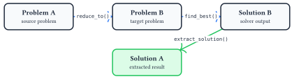
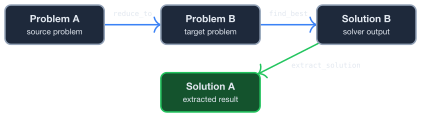

# Getting Started

## What This Library Does

**problem-reductions** transforms hard computational problems into forms that efficient solvers can handle. You define a problem, reduce it to another problem type (like QUBO or ILP), solve the reduced problem, and extract the solution back. The [interactive reduction graph](./introduction.html) shows all available problem types and transformations.

## Installation

Add to your `Cargo.toml`:

```toml
[dependencies]
problemreductions = "0.1"
```

## The Reduction Workflow

The core workflow is: **create** a problem, **reduce** it to a target, **solve** the target, and **extract** the solution back.

<div class="theme-light-only">



</div>
<div class="theme-dark-only">



</div>

### Complete Example

```rust
use problemreductions::prelude::*;
use problemreductions::topology::SimpleGraph;

// 1. Create: Independent Set on a path graph (4 vertices)
let problem = MaximumIndependentSet::<SimpleGraph, i32>::new(4, vec![(0, 1), (1, 2), (2, 3)]);

// 2. Reduce: Transform to Minimum Vertex Cover
let reduction = ReduceTo::<MinimumVertexCover<SimpleGraph, i32>>::reduce_to(&problem);
let target = reduction.target_problem();

// 3. Solve: Find optimal solution to the target problem
let solver = BruteForce::new();
let target_solution = solver.find_best(target).unwrap();

// 4. Extract: Map solution back to original problem
let solution = reduction.extract_solution(&target_solution);

// Verify: solution is valid for the original problem
let metric = problem.evaluate(&solution);
assert!(metric.is_valid());
```

### Chaining Reductions

Reductions can be chained. Each step preserves the solution mapping:

```rust
use problemreductions::prelude::*;
use problemreductions::topology::SimpleGraph;

// SetPacking -> IndependentSet -> VertexCover
let sp = MaximumSetPacking::<i32>::new(vec![vec![0, 1], vec![1, 2], vec![2, 3]]);

let r1 = ReduceTo::<MaximumIndependentSet<SimpleGraph, i32>>::reduce_to(&sp);
let r2 = ReduceTo::<MinimumVertexCover<SimpleGraph, i32>>::reduce_to(r1.target_problem());

// Solve final target, extract back through chain
let solver = BruteForce::new();
let vc_sol = solver.find_best(r2.target_problem()).unwrap();
let is_sol = r2.extract_solution(&vc_sol);
let sp_sol = r1.extract_solution(&is_sol);
```

## Solvers

Two solvers for testing purposes are available:

| Solver | Use Case | Notes |
|--------|----------|-------|
| [`BruteForce`](api/problemreductions/solvers/struct.BruteForce.html) | Small instances (<20 variables) | Enumerates all configurations |
| [`ILPSolver`](api/problemreductions/solvers/ilp/struct.ILPSolver.html) | Larger instances | Requires `ilp` feature flag |

Enable ILP support:

```toml
[dependencies]
problemreductions = { version = "0.1", features = ["ilp"] }
```

**Future:** Automated reduction path optimization will find the best route between any two connected problems.

## JSON Resources

The library exports machine-readable metadata useful for tooling and research:

- [reduction_graph.json](reductions/reduction_graph.json) lists all problem variants and reduction edges
- [problem_schemas.json](reductions/problem_schemas.json) lists field definitions for each problem type


## Next Steps

- Explore the [interactive reduction graph](./introduction.html) to discover available reductions
- Read the [Architecture](./arch.md) guide for implementation details
- Browse the [API Reference](./api.html) for full documentation
