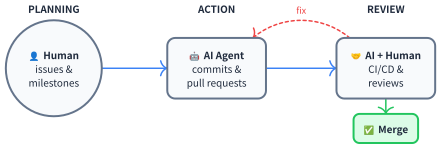
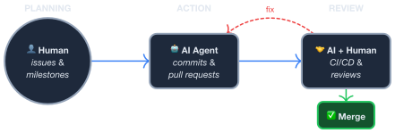

# Problem Reductions

**problem-reductions** is a rust library that provides implementations of various computational hard problems and reduction rules between them. It is designed for algorithm research, education, and industry applications.

## Reduction Graph

  <input id="search-input" type="text" placeholder="Search problems..." style="
    padding: 4px 10px;
    font-size: 13px;
    font-family: sans-serif;
    border: 1px solid var(--sidebar-bg);
    border-radius: 4px;
    background: var(--bg);
    color: var(--fg);
    width: 200px;
  ">

  

    Graph
    Set
    Optimization
    Satisfiability
    Specialized
  

  

    Click a node to start path selection
    <button id="clear-btn">Clear</button>
  

  Click two variant nodes to find a reduction path. Double-click a node for API docs, double-click an edge for source code. Scroll to zoom, drag to pan.

For theoretical background and correctness proofs, see the [PDF manual](https://codingthrust.github.io/problem-reductions/reductions.pdf).

## Our Vision

Computational complexity theory has produced a rich body of polynomial-time reductions between NP-hard problems, yet these results largely remain confined to papers. The gap between theoretical algorithms and working software leads to two persistent inefficiencies:

- **Solver underutilization.** State-of-the-art solvers (SAT solvers, ILP solvers, QUBO annealers) each target a single problem formulation. In principle, any problem reducible to that formulation can leverage the same solver — but without a systematic reduction library, practitioners must re-derive and re-implement each transformation.
- **Redundant effort.** Problems that are polynomial-time equivalent are, from a computational standpoint, interchangeable. Without infrastructure connecting them, the same algorithmic insights are independently reimplemented across domains.

Our goal is to build a comprehensive, machine-readable reduction graph: a directed graph in which every node is a computational problem and every edge is a verified polynomial-time reduction. Given such a graph, one can automatically compose reduction paths to route any source problem to any reachable target solver.

A key enabler is AI-assisted implementation. We propose a pipeline of `algorithm → paper → software`, in which AI agents translate published reduction proofs into tested code. The critical question — can AI-generated reductions be trusted? — has a concrete answer: nearly all reductions admit **closed-loop verification**. A round-trip test reduces a source instance to a target, solves the target, extracts the solution back, and checks it against a direct solve of the source. This property makes correctness mechanically verifiable, independent of how the code was produced.

This library is the foundation of that effort: an open-source, extensible reduction graph with verified implementations, designed for contributions from both human researchers and AI agents.

## Call for Contributions

> **Everyone can contribute — no programming experience required.** If you know a computational problem or a reduction rule, just describe it in a GitHub issue. AI will generate a tested pull request for you to review.
>
> **Contribute 10 non-trivial reduction rules and you will be automatically added to the author list of the [paper](https://codingthrust.github.io/problem-reductions/reductions.pdf).**

1. **Open an issue** using the [Problem](https://github.com/CodingThrust/problem-reductions/issues/new?template=problem.md) or [Rule](https://github.com/CodingThrust/problem-reductions/issues/new?template=rule.md) template
2. **Fill in all sections** — definition, algorithm, size overhead, example instance
3. **Review AI-generated code** — AI generates code and you can comment on the pull request
4. **Merge** — ask maintainers' assistance to merge once you are satisfied

For manual implementation, see the [Architecture](./arch.md#contributing) guide.

## License

MIT License
