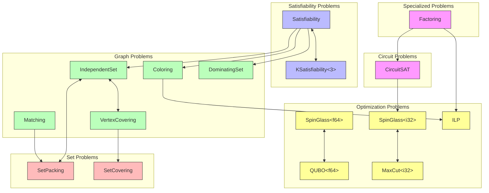

# Reduction Graph

The `ReductionGraph` allows discovering reduction paths between problem types.

## Reduction Diagram



## Legend

| Color | Category |
|-------|----------|
| Pink | Specialized/Circuit Problems |
| Blue | Satisfiability Problems |
| Green | Graph Problems |
| Red | Set Problems |
| Yellow | Optimization Problems |

Bidirectional arrows (`<-->`) indicate reductions exist in both directions.

## Usage

```rust
use problemreductions::prelude::*;
use problemreductions::rules::ReductionGraph;

let graph = ReductionGraph::new();

// Check if direct reduction exists
let has_direct = graph.has_direct_reduction::<IndependentSet<i32>, VertexCovering<i32>>();

// Find all paths between types
let paths = graph.find_paths::<SetPacking<i32>, VertexCovering<i32>>();

// Find shortest path
let shortest = graph.find_shortest_path::<SetPacking<i32>, VertexCovering<i32>>();

// Get statistics
println!("Types: {}, Reductions: {}", graph.num_types(), graph.num_reductions());
```

## Registered Reductions

| Source | Target | Bidirectional |
|--------|--------|---------------|
| IndependentSet | VertexCovering | Yes |
| IndependentSet | SetPacking | Yes |
| VertexCovering | SetCovering | No |
| Matching | SetPacking | No |
| SpinGlass&lt;f64&gt; | QUBO&lt;f64&gt; | Yes |
| SpinGlass&lt;i32&gt; | MaxCut&lt;i32&gt; | Yes |
| Satisfiability | KSatisfiability&lt;3&gt; | Yes |
| Satisfiability | IndependentSet | No |
| Satisfiability | Coloring | No |
| Satisfiability | DominatingSet | No |
| CircuitSAT | SpinGlass&lt;i32&gt; | No |
| Factoring | CircuitSAT | No |
| Coloring | ILP | No |
| Factoring | ILP | No |

## API

```rust
impl ReductionGraph {
    /// Create a new reduction graph with all registered reductions.
    pub fn new() -> Self;

    /// Check if a direct reduction exists from S to T.
    pub fn has_direct_reduction<S: 'static, T: 'static>(&self) -> bool;

    /// Find all paths from source to target type.
    pub fn find_paths<S: 'static, T: 'static>(&self) -> Vec<ReductionPath>;

    /// Find the shortest path from source to target type.
    pub fn find_shortest_path<S: 'static, T: 'static>(&self) -> Option<ReductionPath>;

    /// Get all registered problem type names.
    pub fn problem_types(&self) -> Vec<&'static str>;

    /// Get the number of registered problem types.
    pub fn num_types(&self) -> usize;

    /// Get the number of registered reductions.
    pub fn num_reductions(&self) -> usize;
}
```
